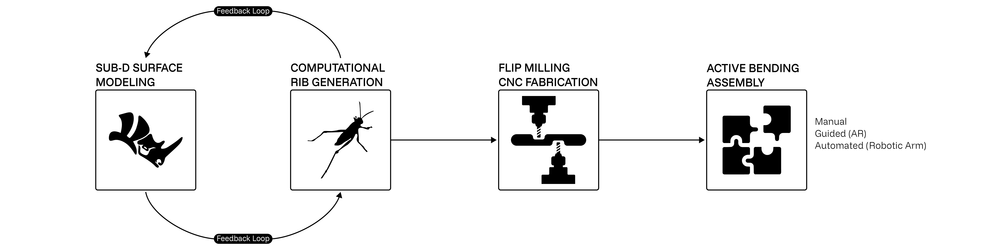
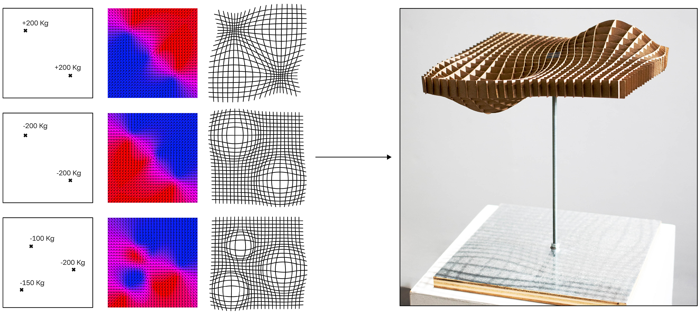
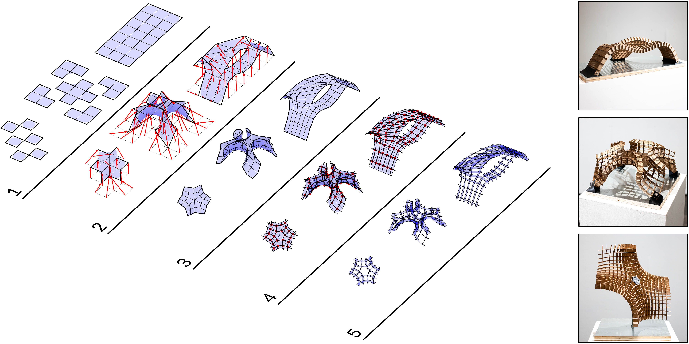
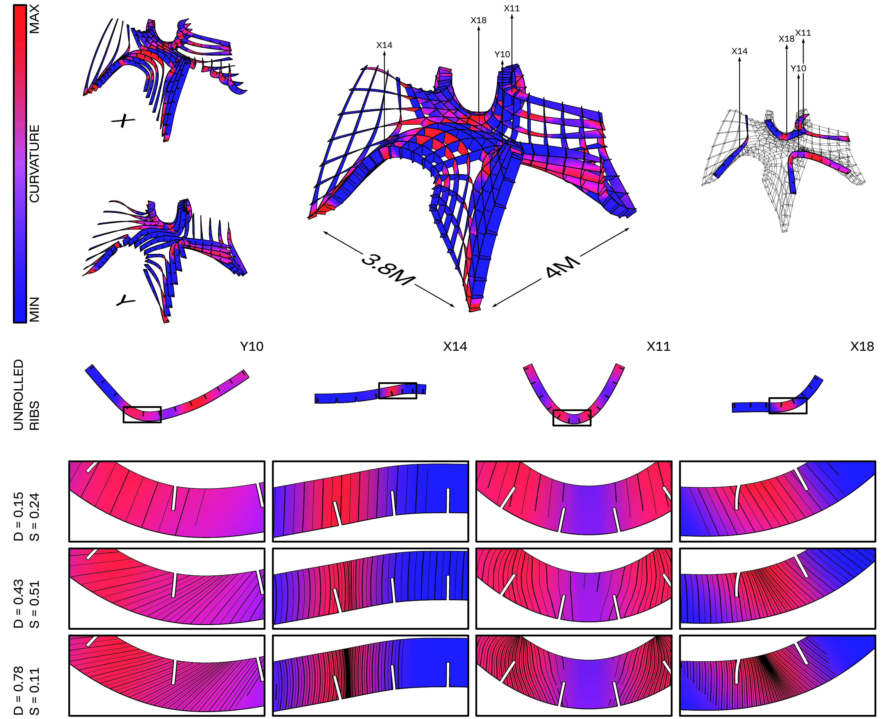
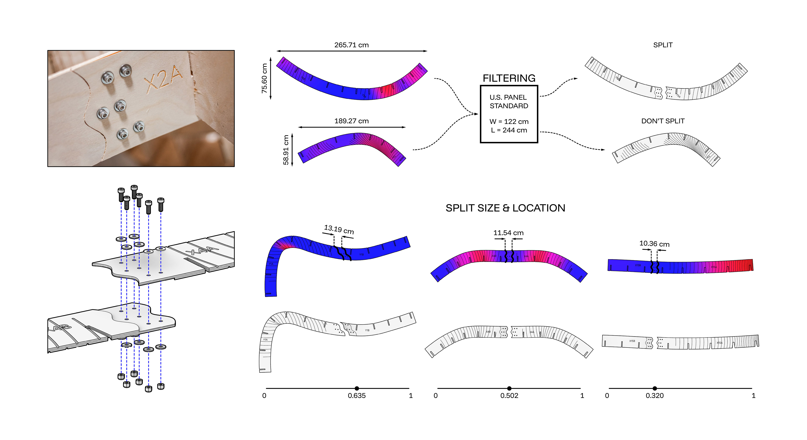
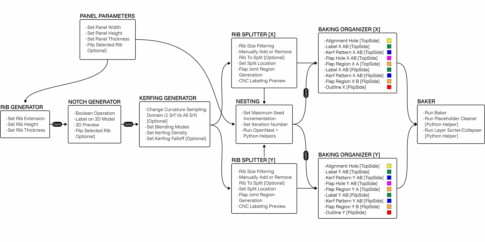
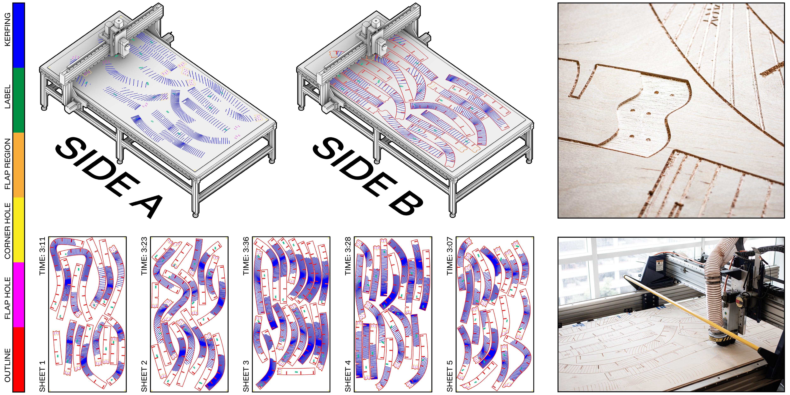
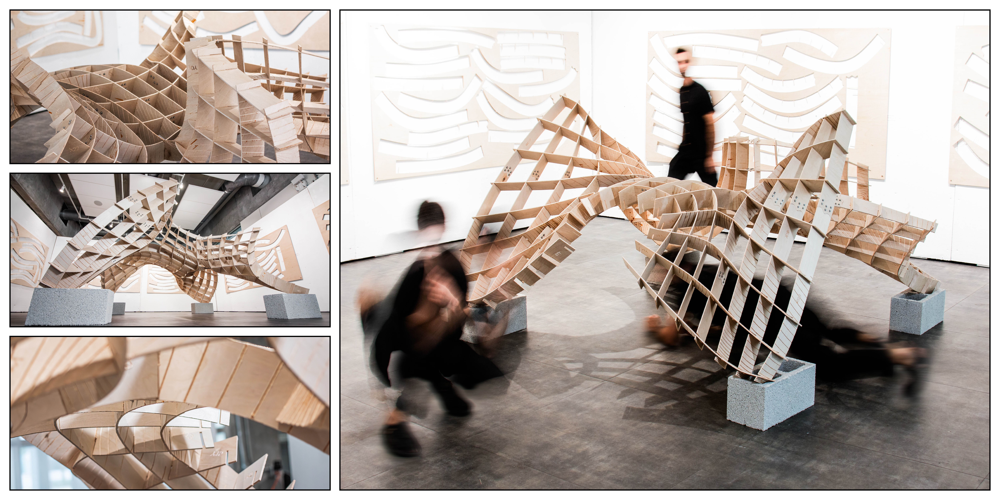

# Chapter 5 — Simplexity and CNC Fabrication: Low-Tech Material Intelligence

The bounded morphogenesis developed in Interlude I is translated here
into a materially explicit fabrication workflow. The project examined in
this chapter expands a topology-derived method for producing
interlocking bent-rib structures through two-dimensional manufacturing
(Urroz et al., 2026). Rather than increasing technological complexity to
achieve complex form, it investigates how computational intelligence can
reorganize flat sheet material, accessible CNC operations, plywood
behavior, and manual assembly into a differentiated spatial structure.
The central question is not how advanced a machine must become, but how
precisely geometry, material, tooling, file organization, and assembly
sequence can be coordinated through constrained means.

The workflow is framed through simplexity: the production of complex
architectural effects through simple, economical, constructible, and
materially intelligible procedures (Crolla, 2018). Flatbed CNC routing,
adaptive kerfing, interlocking joints, nesting, flip milling, labeling,
and bending-active assembly are treated as one design-to-fabrication
system. Intelligence is distributed across the computational model,
machine operations, plywood anisotropy, connection tolerance, file
preparation, and human assembly rather than concentrated in a high-end
fabrication platform.

## 5.1 Simplexity as Fabrication Ethic

Computational architecture frequently associates non-standard geometry
with robotic production, multi-axis machining, bespoke formwork, or
specialist fabrication environments. These methods have expanded
architectural possibility, but they can also reduce transferability when
access depends on expensive equipment, proprietary software, and tacit
expertise. Formal freedom may therefore coexist with technical
dependency.

A low-tech machinic logic addresses this contradiction by relocating
intelligence from the machine alone to the relations among machine,
material, and computational procedure. Flatbed CNC routers, laser
cutters, and other two- or two-and-a-half-dimensional tools do not offer
the spatial freedom of a six-axis robot. Their constraints become
productive when computation activates operations that the machine does
not perform directly: bending, interlocking, differentiated stiffness,
and assembly-based transformation.

Two-dimensional fabrication is consequently treated as a distinct design
grammar rather than a reduced version of three-dimensional machining.
Flat cutting can encode later spatial behavior, allowing a sheet to
operate as a field of latent instructions (Cardoso Llach, 2007).
Profiles, notches, kerf patterns, labels, part divisions, and nesting
positions are not secondary preparation applied after design. They
define how flat components can bend, connect, and acquire collective
stiffness.

The project uses CNC-cut plywood to produce interlocking bending-active
ribs. A structured digital surface is translated into differentiated
members, flattened for machining, locally weakened through kerfing, and
reconstituted through assembly. Complex curvature is not milled directly
into solid stock. It emerges from simple operations coordinated with
material elasticity and connection logic.

This approach requires the material to participate in design. Plywood is
a laminated and anisotropic system with grain direction, thickness,
stiffness, bending resistance, lamination quality, humidity response,
and failure limits. These conditions determine how far a rib can deform
and where material can be removed safely. Kerfing activates bending by
selectively reducing stiffness, but the pattern must remain compatible
with handling, interlocking, and structural continuity. The workflow
therefore departs from a hylomorphic model in which geometry is imposed
on passive matter and instead works with material capacity and
resistance (DeLanda, 2004).

The objectile offers a useful but limited description of this framework.
The system does not define one immutable object; it defines a parametric
family in which topology, rib density, curvature, joint geometry, kerf
distribution, and assembly can vary while retaining a common procedural
logic (Cache, 1995). Yet this variation is not an unrestricted
file-to-factory ideal. It is bounded by sheet dimensions, tool diameter,
grain orientation, material thickness, topological continuity, bending
capacity, notch tolerance, and assembly force.

Simplexity therefore functions as a fabrication ethic as well as a
technical strategy. It connects formal ambition to the accessibility and
intelligibility of the means through which form is produced. The
relevant question is not whether low-cost fabrication can imitate the
visual effects of high-end machinery, but whether computation can
organize a method that is teachable, adaptable, materially economical,
and available to schools, small practices, and shared workshops.

Three principles structure this ethic. First, computation should clarify
material and fabrication processes rather than conceal them. Second,
fabrication must participate in design development rather than execute a
completed geometry downstream. Third, complexity should be evaluated
through the relation among spatial effect, material use, technical
accessibility, and the capacity of others to understand and adapt the
method.

## 5.2 CNC as Pre-Robotic Machinic Logic

The workflow begins from a deliberately restricted fabrication premise:
a flatbed CNC router performs cutting, engraving, profiling, and
labeling on sheet material, while spatial form is produced later through
bending and assembly. The machine does not directly manufacture the
final three-dimensional geometry. It prepares a material kit whose
encoded relationships become active when the components are deformed and
interlocked.

CNC is described here as a pre-robotic machinic logic not because it is
primitive or obsolete, but because it makes several conditions later
intensified in robotic fabrication comparatively explicit. Digital
geometry must be translated into toolpaths and machine operations; stock
must be registered; tool diameter and cutting depth must be accounted
for; tolerances must be tested; and machining operations must occur in a
coordinated order. The restricted motion of the flatbed machine makes
these relations legible and provides a pedagogical threshold between
manual construction and more complex robotic workflows.

The method moves repeatedly between two- and three-dimensional states
(Figure 5.1). A spatial surface becomes a network of ribs; those ribs
become flat manufacturing data; and the cut components return to spatial
form through material deformation. This recurrent movement distinguishes
the workflow from direct shaping. The CNC router provides repeatable
two-dimensional operations, while plywood elasticity, notch geometry,
kerf distribution, and assembly sequence produce differentiated spatial
behavior.

<figure id="figure-5-1" class="dissertation-figure">
  
  <figcaption><strong>Figure 5.1.</strong> General 2D-to-3D workflow translating computational surface geometry into CNC-cut, bending-active rib structures. Adapted from the author’s previous study on topology-derived interlocking bent rib fabrication.</figcaption>
</figure>

The relative accessibility of CNC machinery does not automatically make
the workflow accessible. Machine availability must be accompanied by
material knowledge, file organization, machining sequence, tolerance
calibration, and documentation. Shared fabrication environments
demonstrate the value of distributing tools and methods, but they also
reveal persistent barriers involving usability, embedded expertise,
sustainability, and the translation of digital models into reliable
physical outcomes (Baudisch & Mueller, 2017; Walter-Herrmann & Büching,
2014).

For this reason, the chapter treats CNC preparation and assembly
information as part of the research contribution. Toolpath logic, face
separation, labels, nesting, flip-milling registration, and part
sequence are included in the computational workflow rather than
delegated to undocumented shop-floor adjustment. CNC becomes a situated
interface through which computational geometry, material behavior, and
manual labor remain connected.

This position is also postdigital. The router is not presented as a
symbol of technological novelty, nor as a lesser substitute for
robotics. It is an ordinary but consequential instrument embedded in a
hybrid practice combining computation, material testing, machine
operation, and hand assembly (Jandrić, 2018). Its restriction
establishes the field within which design decisions become materially
accountable.

## 5.3 Topology-Derived Rib Structures

The first part of the workflow establishes how a flat sheet-based
process can become a spatial rib system. The rib structure begins with
the controlled deformation of a structured square grid. Vector
displacement generates vertical and horizontal curves that define a
continuous network of intersecting members (Figure 5.2). The grid
operates simultaneously as a geometric scaffold, a structural diagram,
and a fabrication organization. Its lines do not merely represent a
surface; they become the paths from which physical ribs are derived.

<figure id="figure-5-2" class="dissertation-figure">
  
  <figcaption><strong>Figure 5.2.</strong> Vector deformation of a structured grid under different loading conditions, establishing the geometric basis for the interlocking rib system.</figcaption>
</figure>

Conventional waffle structures usually rely on planar ribs and
orthogonal notches. Their manufacturability derives from the ability to
extract flat profiles from a three-dimensional form. The present system
modifies this logic by permitting ribs to curve and, within limited
tolerances, twist. The resulting members can approximate doubly curved,
funicular, or minimal-surface conditions while retaining the economy of
sheet fabrication.

This increased geometric capacity complicates the joints. An
intersection between curved ribs cannot always be resolved through a
standard rectangular notch. The interface must respond to material
thickness, local angle, curvature, and torsion. As the intersection
departs from ninety degrees, the notch must widen and rotate to preserve
assembly clearance. Joint geometry is therefore derived from the actual
spatial relation between members rather than imposed as a uniform
detail.

The notch acts as a localized negotiation between two curved ribs. It
must remove enough material for the parts to interlock, but not so much
that the connection loses positional control. Its dimensions are
affected by plywood thickness, the effective diameter of the cutting
bit, the angle between the two rib surfaces, and the deformation
expected during assembly. This makes joint generation inseparable from
both geometric computation and fabrication tolerance.

A quad-mesh topology organizes rib directionality. SubD modeling permits
a relatively low-density control mesh to regulate a smoother and more
complex surface, supporting iterative changes to vertex position, mesh
density, curvature, and global form. Face-center loops generate
directional paths that become the U- and V-rib families. The topology of
the surface is thus directly connected to the topology of the fabricated
network.

The centers of adjacent mesh faces are interpolated into continuous
loops. These loops provide the centerline logic from which rib surfaces
are generated and offset according to the material thickness. Because
each loop follows the mesh structure, changes to topology affect not
only the visual surface but also the continuity, orientation, and number
of fabricated members.

This relation allows the system to generate related variations through
one rule set. Changes to the control mesh alter rib paths,
intersections, and overall configuration while maintaining the same
process of extraction, joint generation, flattening, kerfing, and
assembly. Figure 5.3 shows this translation from mesh organization to
digital rib grammar and physical models.

<figure id="figure-5-3" class="dissertation-figure">
  
  <figcaption><strong>Figure 5.3.</strong> Topology-derived 2D-to-3D generative grammar and physical rib models showing the translation from mesh organization to interlocking spatial structures.</figcaption>
</figure>

The mesh is not a neutral field of formal possibilities. Seam
conditions, normal direction, singularities, and inside-outside
inversions directly affect whether rib paths can be extracted and offset
coherently. Periodic, minimal, and doubly curved surfaces can contain
shifts in face orientation or seam conditions that are visually
acceptable at the level of the smooth surface but disruptive to
fabrication logic.

Opposing face normals can reverse rib offsets at junctions. When
neighboring faces point in opposite directions, a thickness offset can
move one rib toward the intended exterior and the adjacent rib toward
the interior. The result is a discontinuity or inversion that prevents
the parts from intersecting as expected. The workflow therefore includes
normal inspection and correction before rib generation.

Seam conditions produce another difficulty. A clothed or welded seam may
close a mesh topologically while causing face-loop directions to change
or stop. Converting selected seam edges into naked edges provides one
means of controlling the boundary and restoring the intended
directionality. This operation may appear minor in the digital model,
but it determines whether the rib can be extracted as one coherent
fabrication element.

Mesh singularities also influence whether rib networks remain
continuous. Face-loop directionality is crucial because ribs depend on
uninterrupted paths through the mesh. Six-edge junctions may remain
compatible with the network, while three- or five-edge singularities can
interrupt rib generation when they occur within closed loops.
Singularities at open boundaries are generally less disruptive because
the network does not need to continue through the same closed
topological condition.

These problems were not treated as abstract mesh-cleaning tasks. Each
one corresponded to a fabrication consequence: a broken rib path, a
reversed offset, an impossible joint, or a component that could not be
unrolled coherently. The workflow therefore required repeated checking
of topology before downstream operations such as kerfing and nesting
could be trusted.

After generation, each three-dimensional rib surface must be returned to
flat CNC information. Exact unrolling without distortion is possible
only for developable surfaces with zero Gaussian curvature. Some ribs in
the system contain slight double curvature, so flattening introduces
limited deformation. Paper studies were used to test whether the
resulting stretch remained small enough for the components to be cut and
bent back into place.

The experiment indicated that the distortion was negligible for the
selected geometry and scale, allowing the workflow to proceed. This
result should not be generalized to every possible member of the
parametric family. Stronger double curvature, greater rib width, thicker
material, or larger scale would increase the difficulty of flattening
and could invalidate the same procedure.

The movement between flat and spatial states is central to the method.
Grid organization produces a topological rib network; the network is
flattened into profiles, joints, and later kerf fields; and the
components recover spatial geometry during bending and assembly. The
sheet therefore contains encoded spatial relationships rather than
remaining neutral planar stock.

## 5.4 Kerfing, Bending, and Material Intelligence

The kerfing workflow was tested through a half-scale physical prototype
based on a deliberately demanding, highly curved, non-quadri-symmetrical
geometry. The selection avoided a regular or repetitive surface in order
to expose variation in bending demand, joint orientation, rib length,
and assembly force. Flat plywood members had to reach differentiated
curvatures while retaining enough continuity to remain part of an
interlocking structure.

Kerfing produces localized flexibility by removing material without
cutting completely through the sheet. The operation reduces section
depth and therefore bending resistance along selected regions. Its
effect depends on kerf density, spacing, orientation, depth, tool
diameter, material thickness, lamination, and grain direction. Too
little kerfing prevents the member from reaching the target curvature;
too much produces overlapping cuts, fragility, or fracture.

The first difficulty was therefore calibration. A kerf pattern cannot be
derived from curvature alone without accounting for how the selected
plywood and tool respond. If the spacing becomes smaller than the
effective width of the router cut, adjacent grooves overlap and remove
more material than intended. If the engraving is too shallow, the rib
remains too stiff. If it is too deep, the outer laminations are severed
and the component can crack during handling or assembly.

Curvature analysis determines where additional flexibility is required.
Regions of greater bending demand receive denser kerf fields, while
flatter or structurally sensitive zones preserve more material. The
pattern therefore operates as a material performance map rather than a
visual texture (Figure 5.4). Comparable programmable kerfing research
demonstrates how cut distribution can induce controlled bending and
torsion without steam bending, molds, or complex forming equipment
(Loyola et al., 2017; Naboni & Marino, 2021; Porterfield, 2015).

<figure id="figure-5-4" class="dissertation-figure">
  
  <figcaption><strong>Figure 5.4.</strong> Adaptive kerf pattern preview showing different density and spread settings used to tune plywood flexibility according to curvature demand.</figcaption>
</figure>

The workflow considers both mean and Gaussian curvature. Mean curvature
describes the primary bending demand of a rib surface and is appropriate
when the member bends predominantly in one direction. Gaussian curvature
identifies regions that depart from simple developable bending. Even
when the Gaussian component remains low enough to permit approximate
flattening, it can identify locations where the plywood must negotiate
more complex deformation.

Several mathematical operations were tested to merge these values into
one kerf-density field. The workflow adapts the lighten blending
operation by assigning the maximum of the normalized mean and Gaussian
curvature values. Wherever either field indicates stronger deformation,
the resulting kerf distribution increases flexibility. This operation
proved more responsive to localized double-curvature effects than mean
curvature alone.

The resulting pattern identifies where the rib should remain stiff,
where it needs to bend, and where material continuity should not be
excessively reduced. The CNC router engraves the kerfs rather than
cutting through the plywood. Material continuity is preserved across the
member while local stiffness is reduced.

Flip milling applies kerf fields to both faces, but the two patterns are
offset so that cuts do not align through the thickness. Staggering
avoids continuous fracture lines and maintains a more coherent
structural path through the laminated material. This two-sided strategy
increases flexibility while reducing the risk that one deep or aligned
cut pattern will divide the member.

The workflow thereby uses machining to program differentiated response.
The computational model interprets curvature, the router inscribes a
variable reduction of stiffness, and the plywood responds through
bending. Material intelligence does not belong to one element in
isolation; it emerges through the relation among analysis, machining,
lamination, grain, and assembly.

The full-scale design measured approximately 4 × 4 × 2.5 m. The
fabricated half-scale prototype measured approximately 2 × 2 × 1.25 m.
Reducing the scale limited material cost and fabrication risk while
testing whether the encoded kerf fields produced sufficient flexibility
for assembly. The prototype verified the workflow at that scale, but it
does not establish equivalent structural or bending behavior at full
scale because thickness, member depth, self-weight, connection force,
and stiffness do not scale linearly.

Some unrolled ribs exceeded the standard 122 × 244 cm plywood sheet. The
computational model therefore identified parts requiring segmentation
and generated reinforced lap regions only where necessary (Figure 5.5).
Continuous ribs were preserved whenever they fit within the stock
dimensions; segmentation was not applied uniformly.

<figure id="figure-5-5" class="dissertation-figure">
  
  <figcaption><strong>Figure 5.5.</strong> Flap generation logic for segmenting oversized ribs and generating reinforced lap connections within standard sheet dimensions.</figcaption>
</figure>

The split regions use overlapping flaps and bolted connections to
reconnect the rib segments. The difficulty was to place the overlap
where it could be machined, assembled, and reinforced without
interrupting the broader bending behavior. A split located in a highly
curved or densely kerfed zone would concentrate weakness and complicate
alignment. The workflow therefore coordinates sheet limits, curvature,
kerf distribution, and lap placement rather than treating segmentation
as an independent operation.

Physical assembly confirmed that geometric analysis cannot predict
plywood response completely. Grain variation, lamination quality,
humidity, local imperfections, engraving depth, and handling force
changed how individual components bent. Similar digital curvature values
did not always produce identical physical behavior. Some ribs required
more force than anticipated, while highly kerfed regions had to be
handled carefully to avoid localized damage.

These differences were not removed from the account as fabrication
noise. They revealed the limits of a purely geometric model and the need
for material judgment during assembly. Kerfing does not eliminate
contingency; it creates a calibrated range within which the plywood can
be brought toward the intended spatial configuration.

## 5.5 Fabrication Computational Model for Nesting and Assembly Sequence

Once rib geometry, notches, kerf fields, and lap connections were
established, the workflow shifted from material calibration to
fabrication organization. Components had to be converted into
CNC-readable, side-specific, and assembly-ready information. The
Grasshopper definition coordinates rib extraction, unrolling, notch
generation, curvature analysis, kerf assignment, segmentation, lap
generation, face separation, labeling, and nesting (Figure 5.6).

<figure id="figure-5-6" class="dissertation-figure">
  
  <figcaption><strong>Figure 5.6.</strong> Open-source Grasshopper definition flowchart.</figcaption>
</figure>

The definition functions as the operational interface between the
spatial model and the fabrication package. Because the operations remain
linked, a change to the surface or mesh can propagate through rib
generation and manufacturing preparation. The workflow is therefore more
than a modeling script: it is a protocol for maintaining correspondence
among design geometry, machining data, and assembly information.

Nesting places the unrolled components within standard plywood sheets
while negotiating spacing, rotation, grain orientation, CNC-bed limits,
and material efficiency. OpenNest was used to generate layouts. To
reduce processing time, simplified low-resolution polylines without full
notch detail were nested first. The resulting transformations were then
transferred to the complete fabrication geometry.

This simplification was necessary because nesting full-resolution
outlines containing every notch, kerf, and lap detail increased
computation without improving the gross placement of parts. By
separating placement geometry from machining geometry, the workflow
reduced calculation time while preserving the final fabrication
information.

Two-dimensional nesting typically uses genetic or heuristic approaches
to search among possible arrangements (Babu & Babu, 2001). Within this
workflow, seed variation affected the result more substantially than
simply increasing the number of iterations. Improvement followed
diminishing returns after a certain point. Running more iterations on
one poor seed did not necessarily produce a better layout than testing
several alternative seeds.

A Python helper was therefore developed to test and manage seeds more
efficiently. The tool did not replace OpenNest; it helped organize
repeated runs and compare results without manually changing seeds one by
one. This workaround addressed a practical bottleneck in the fabrication
workflow: locating usable layouts within a reasonable computation time.

The nesting result was not treated as a guaranteed global optimum. It
provided a workable compromise among sheet use, spacing, grain
orientation, and fabrication time. Manual inspection remained necessary
because a mathematically compact layout could still conflict with grain
direction, flip-milling registration, or the need to preserve clear
machining zones.

The half-scale prototype used 5 mm, three-ply birch plywood. Grain
orientation proved critical. Ribs bent poorly when the grain ran
parallel to the kerf direction and more effectively when the grain ran
perpendicular. The cross-laminated structure allowed the outer layers to
be engraved while a transverse inner layer maintained continuity.

This material behavior constrained rotation during nesting. A part could
not be freely rotated simply to fill an empty area of a sheet if that
orientation placed the grain unfavorably relative to the kerf pattern
and intended bend. Material efficiency therefore had to be negotiated
with bending performance rather than optimized independently.

Digital preparation ended with baking the CNC geometry for flip milling.
Each rib was baked as Side A and Side B, with color and layer
organization preserving its parent group and machining role (Figure
5.7). Side A contained kerfs, labels, lap regions for one side of the
connection, and lap holes. Side B contained the complementary kerfs,
labels, lap regions, and final outlines.

<figure id="figure-5-7" class="dissertation-figure">
  
  <figcaption><strong>Figure 5.7.</strong> Ribs color-coded by parent and baked on Side A and Side B.</figcaption>
</figure>

This separation ensured that staggered kerfs and lap details aligned
after the sheet was flipped. It also made the machining sequence
inspectable before export. Mixing the two faces or losing component
identity at this stage could produce a part that appeared correct in
outline but failed during assembly because its kerfs or lap recesses
were machined on the wrong side.

The machining setup was organized through four CNC jobs using two
primary tools. An approximately 1/8 in (3 mm) ball-nose bit was used for
kerf engraving and labels. An approximately 1/8 in (3 mm) flat downcut
bit was used for lap regions, holes, and component outlines.

Registration holes at the corners of the sheet and in the MDF
sacrificial board were produced with an approximately 1/2 in (13 mm)
flat downcut bit. Dowels or corresponding registration points allowed
the sheet to be repositioned after flipping while preserving the
coordinate relationship between Side A and Side B.

Flip-milling registration was a critical difficulty because small
misalignments accumulated across narrow kerfs, lap recesses, and
outlines. If the sheet shifted or rotated during the flip, the two kerf
fields could overlap unintentionally, lap regions could become uneven,
and outlines could remove more material from one side than expected. The
registration holes therefore translated digital face correspondence into
a repeatable physical setup.

Layer management became another practical fabrication problem.
Grasshopper can bake geometry into Rhino in inconsistent or expanded
layer structures. When numerous ribs, faces, machining operations, and
parent groups are involved, this can create a file that is difficult to
inspect and risky to transfer into RhinoCAM.

Python helper scripts were created to sort layers naturally and collapse
unnecessary top-level hierarchies. Natural sorting ensured that numbered
components appeared in an intelligible order rather than
lexicographically—for example, preventing Rib 10 from appearing between
Rib 1 and Rib 2. Collapsing redundant parent layers reduced navigation
depth and made it easier to verify which geometry belonged to each
machining operation.

This file-cleaning step may appear peripheral compared with geometric
design, but it directly reduced the possibility of fabrication error. A
mislabeled layer or hidden operation can send the wrong tool to the
wrong depth, omit necessary geometry, or cause one face to be machined
with the other's settings. File hygiene was therefore treated as part of
machinic legibility.

Labels transferred component identity and orientation from the
computational model to the assembly environment. This was necessary
because the prototype was highly differentiated: visually similar ribs
were not interchangeable. Each component carried a specific position,
notch arrangement, side orientation, lap condition, kerf field, and
bending requirement.

The assembly sequence was equally consequential. Flexible members could
not be placed in arbitrary order. Each rib had to be bent, aligned, and
interlocked relative to its neighbors. Some connections became
inaccessible after adjacent components were installed, while other ribs
required the partial stiffness of the existing assembly before they
could be positioned.

The structure therefore acquired stiffness progressively. Individual
ribs remained flexible and difficult to control; the network became
coherent as more intersections were completed. Stability emerged
collectively through interlocking geometry, lap reinforcement, and
cumulative constraint rather than residing in the isolated components.

Tolerance governed whether this process remained possible. Tight notches
increased assembly force and risked damaging weakened regions; loose
notches reduced positional control and collective stiffness. Tool
diameter, actual plywood thickness, kerf depth, flip-milling
registration, material variation, and human handling all influenced the
fit.

The nominal digital thickness could not simply be assumed to equal the
effective physical thickness of every sheet. Plywood variation, surface
finish, and machining behavior altered the joint. The workflow therefore
required test cuts and adjustment before committing the complete set of
components.

The resulting prototype and detail views are shown in Figure 5.8. The
physical model demonstrates that the computational package can produce,
identify, bend, reconnect, and assemble differentiated ribs into a
coherent structure at half scale. It also exposes the residual
dependence on material judgment, careful file preparation, and manual
adjustment.

<figure id="figure-5-8" class="dissertation-figure">
  
  <figcaption><strong>Figure 5.8.</strong> Final half-scale bending-active rib prototype and close-up views of kerfed ribs, lap connections, and interlocking assembly details.</figcaption>
</figure>

## 5.6 Contribution to the Design-to-Fabrication Continuum

The workflow demonstrates that complex spatial behavior can be produced
through accessible and comparatively simple fabrication means. Standard
plywood, flatbed CNC operations, adaptive kerfing, flip milling, bolted
lap connections, labeling, and manual assembly are coordinated through a
computational protocol. The machine does not directly produce the final
form; it prepares differentiated material conditions through which
spatial organization emerges.

Its primary contribution is the operationalization of simplexity.
Complexity is distributed across topology, joint geometry, material
deformation, toolpath organization, nesting, file management,
registration, and assembly rather than achieved through the escalation
of machine capability. The workflow makes machining constraints and
material behavior part of design development and therefore extends the
bounded emergence introduced in Interlude I into a tangible
sheet-material system.

The technical difficulties are central to this contribution. Mesh
normals and seams affected rib continuity; singularities disrupted face
loops; slight double curvature complicated unrolling; kerf density had
to balance flexibility with fracture risk; grain constrained nesting
orientation; oversized ribs required carefully placed lap joints; flip
milling required reliable registration; layer structures had to be
cleaned before machining; and assembly tolerance had to negotiate
digital precision with physical variation. These were not incidental
problems surrounding the method. They were the conditions through which
the method was developed and made intelligible.

Relative to the methodological criteria established in Chapter 3, the
workflow demonstrates operational integration by linking surface
topology to ribs, notches, kerfs, segmentation, nesting, machine
operations, and assembly information. It demonstrates feedback
responsiveness through material and fabrication tests that inform kerf
density, grain orientation, lap placement, tolerance, and sequencing.
Its methodological legibility is supported by the Grasshopper
definition, explicit face organization, labels, helper scripts,
registration strategy, and documented machining sequence.

Transferability remains plausible rather than fully verified. The
workflow relies on comparatively common materials and equipment and can
generate related variations through one rule system, but independent
reconstruction, teaching outcomes, or modification by external users
would provide stronger evidence. Similarly, material economy is
supported through nesting, sheet construction, and the avoidance of
bespoke formwork, yet ecological accountability would require assessment
of plywood sourcing, machining energy, tool wear, waste, connection
hardware, durability, and reuse.

The chapter therefore does not claim that low-tech fabrication is
inherently ecological or universally accessible. Its contribution is
more precise: it shows how computational design can remain formally
ambitious while making material behavior, machine limits,
troubleshooting, and human assembly visible within the workflow. This
establishes a foundation for Chapter 6, where machinic logic is extended
from standardized plywood sheets to scanned, irregular timber and from
flatbed CNC operations to robotic milling.
