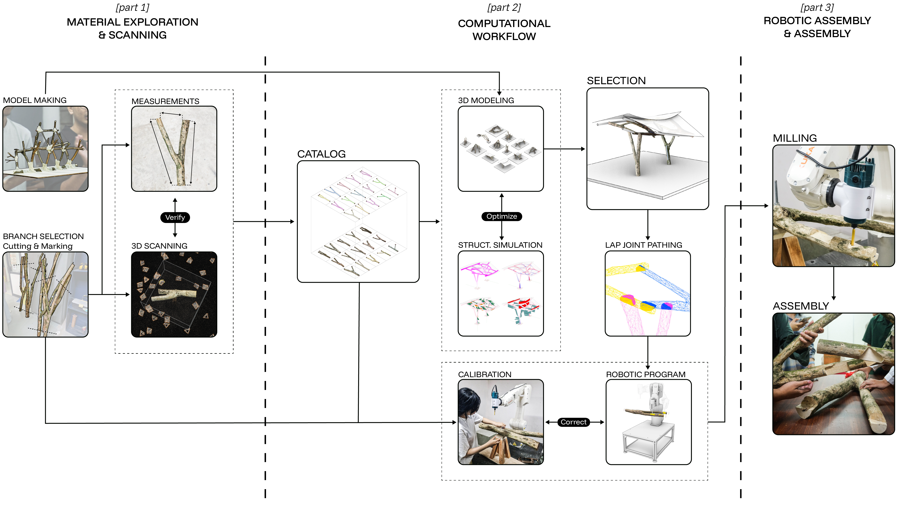
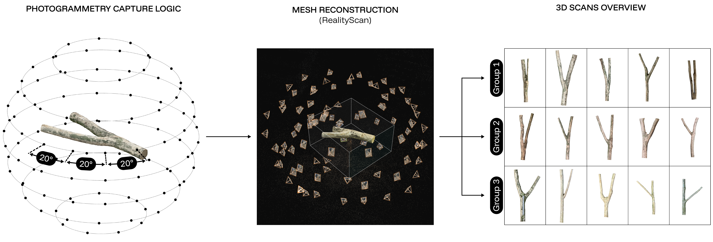
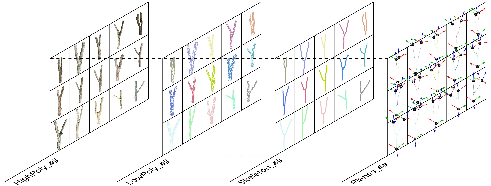
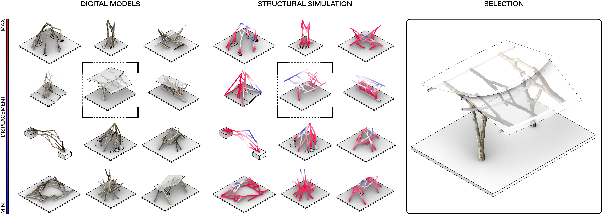
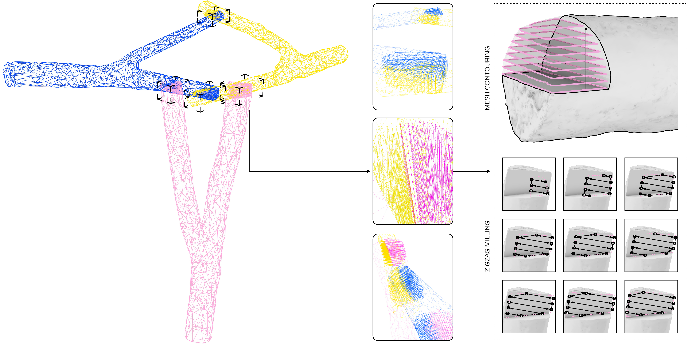
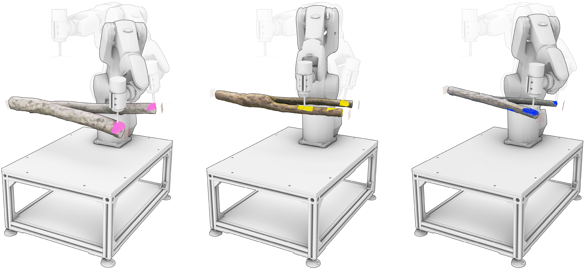
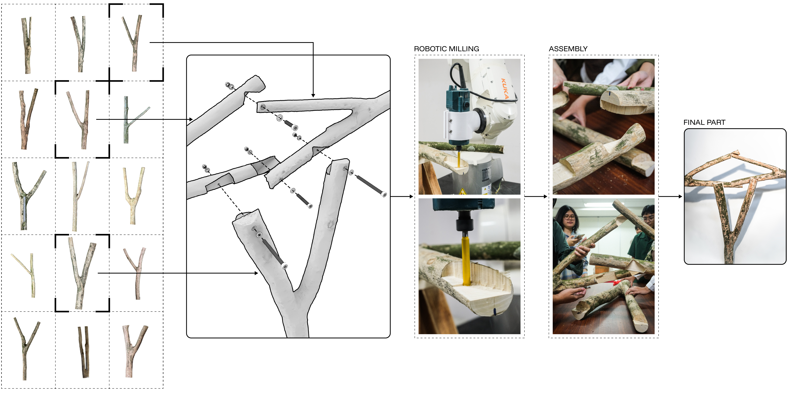
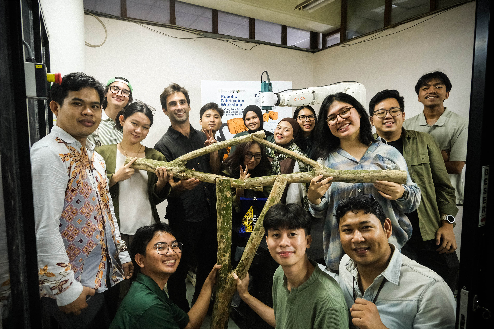

# Chapter 6 — Machinic Logic and Robot Material Practice

The transition from CNC fabrication to robotics does not replace the
machinic logic developed in Chapter 5; it extends that logic into a
larger spatial and operational field. Numerical control still
coordinates geometry, tool motion, material removal, and fabrication
sequence, but the six-axis robotic arm adds variable tool orientation,
reach, joint configuration, approach direction, calibration, collision
management, and piece-specific positioning. These capacities become
architecturally significant when they are integrated with the geometry
and behavior of the material being fabricated.

The workflow examined here, Crafting Tree Forks: An Open Framework
Leveraging Structural Intelligence of Irregular Timber Through Robotic
Joinery Milling, investigates this integration through discarded timber
bifurcations, analogue form-finding, smartphone photogrammetry, digital
cataloguing, structural comparison, computational joinery,
manual–robotic registration, and milling (Urroz et al., 2026). Rather
than converting irregular timber into standardized stock, the process
retains branching angle, curvature, cross-section, and local surface
geometry as information that guides selection, assembly, joint
generation, calibration, and machining.

## 6.1 Machinic Logic Through Material Practice

A robotic arm is not a neutral executor of geometric commands. Its
operation depends on coordinate systems, tool frames, joint limits,
reach envelopes, singularities, feed rates, payload, approach and
retraction vectors, fixtures, end-effectors, material resistance, and
task sequence. These conditions become part of architectural design when
they enter the same computational environment as geometry, structure,
and material description.

Robotic fabrication often appears inaccessible because motion planning
and execution are divided among proprietary controllers,
post-processors, specialist plug-ins, and tacit workshop knowledge.
Designers may generate geometry in a parametric environment while
machine behavior is resolved later by a technician or in a separate
software stack. This division reproduces the separation between
conception and execution even when the final production process is
digitally controlled.

Demystification begins by exposing the operations shared by
computational modeling and robotic motion. Both rely on vectors, planes,
transformations, coordinate frames, constraints, and relational
dependencies. A geometric curve becomes a robotic toolpath only when it
acquires orientation, speed, sequence, approach logic, and machine
feasibility. A surface normal becomes a possible tool axis; a plane
becomes a calibration frame; and a spatial relationship becomes a
sequence of executable targets.

The workshop organized these translations as a visible chain connecting
material exploration, digital cataloguing, computational joinery,
structural analysis, calibration, milling, and assembly (Figure 6.1).
The robot was therefore presented not as an isolated fabrication device,
but as one participant within a larger workflow involving material
handling, geometric abstraction, machine setup, participant
interpretation, and physical verification.

<figure id="figure-6-1" class="dissertation-figure">
  
  <figcaption><strong>Figure 6.1.</strong> Workshop pedagogical workflow linking material exploration, digital cataloguing, computational joinery, robotic calibration, milling, and assembly. The diagram frames machinic logic as a distributed process rather than as an isolated act of robotic execution.</figcaption>
</figure>

Material practice is essential to this legibility. Standardized stock
permits predictable machining because variation has already been reduced
before the material reaches the machine. Irregular branches reverse this
condition. Each piece requires a specific scan, orientation, fixture,
joint, toolpath, and registration procedure. Machinic logic can no
longer remain implicit because the material continually exposes the
assumptions on which machine precision depends.

This condition also reconnects computation with craft. Traditional
timber practice relies on embodied judgment developed through handling,
visual inspection, tool familiarity, and adjustment to grain and
geometry. Robotic processing redistributes portions of this judgment
into scanning, digital models, toolpath parameters, calibration
routines, and machine monitoring, but it does not eliminate human
interpretation. Human-in-the-loop approaches to natural branch
fabrication similarly demonstrate that computational precision and
material judgment remain coupled (Larsson et al., 2019).

The resulting process is phygital in the specific sense that physical
material and digital description repeatedly inform one another (Yan &
Yuan, 2024). The fork is handled and assessed before scanning; its
digital mesh becomes part of an assembly; structural and fabrication
checks alter that assembly; calibration reconnects the mesh to the
physical piece; and milling tests whether the digital joint can be
realized. The workflow is iterative, but it is not a fully closed or
real-time feedback loop. Several exchanges depend on manual measurement,
participant interpretation, visual checking, and deliberate return to
earlier stages.

## 6.2 Irregular Timber Against Industrial Standardization

Timber is frequently positioned as an alternative to carbon-intensive
construction because trees store biogenic carbon during growth and wood
can substitute for materials with higher embodied impacts. This
ecological promise is nevertheless conditioned by industrial processing.
Curved segments, small-diameter logs, offcuts, and branch forks are
often excluded because they do not conform to standardized dimensions,
predictable grain direction, or regular machining protocols (Pramreiter
et al., 2023). Renewable material is consequently filtered through a
production system that recognizes only a restricted portion of the tree.

This filtering is both material and epistemic. Industrial timber
products—boards, beams, veneers, sheets, and engineered profiles—support
predictable calculation, transportation, and construction. They also
remove much of the evidence of growth before design begins. Curvature
becomes defect, bifurcation becomes waste, and local variation becomes a
problem to be eliminated rather than a condition capable of informing
structural organization.

Tree forks make this contradiction especially visible. At a bifurcation,
trunk and branch are connected through continuous fibre transitions and
localized material reinforcement rather than through a separately
fabricated joint. The branch collar redirects stresses through curved
grain and changing cross-sections. Its structural behavior is not
determined by ideal geometry alone, but by the way the tree has grown in
response to load and environmental conditions.

Naturally curved and forked elements were historically selected for ship
knees, braces, and heavy-timber junctions because their fibre continuity
could follow the geometry of the connection more effectively than
straight members cut across the grain (Torghabehi et al., 2018).
Contemporary research continues to examine how branch geometry, fibre
transition, and local morphology can inform load-bearing assemblies
(Gata et al., 2024). These studies do not imply that every fork is
structurally superior or immediately suitable for construction; they
establish that the bifurcation contains differentiated mechanical
information that standardized stock does not preserve.

Research on non-standard timber increasingly combines scanning,
geometric matching, analysis, and digital fabrication to retain this
information (Allner et al., 2021; Amtsberg et al., 2020; Dai et al.,
2025). Site-based projects such as Foraging for a Field Station
similarly investigate how fabrication can remain close to material
sources and work with available geometry rather than requiring all
timber to pass through centralized standardization (Vercruysse et al.,
2024). Cooperative robotic workflows for tree-fork structures further
demonstrate the technical potential of integrating irregular geometry
with robotic fabrication, while also revealing the complexity of
scanning, fixturing, and coordination required (Chai et al., 2024).

The fork nevertheless resists typological repetition. Branching angle,
curvature, diameter, scars, grain, and local deformation differ from
piece to piece and cannot be completely specified before acquisition.
Design must therefore begin with an inventory of actual material rather
than an abstract family of interchangeable components. Each piece is
handled, documented, compared, oriented, and assigned a role according
to its available geometry.

Computation supports this reversal by making singular material
conditions comparable without erasing them. A digital mesh does not
transform the fork into a generic object; it provides a representation
through which morphology can participate in design reasoning. The scan
makes branching angle, local thickness, orientation, and possible
connection regions available for cataloguing, assembly, joinery
generation, and machine registration.

Irregular timber therefore establishes a material-first premise for the
design-to-fabrication continuum. Instead of designing an idealized
structure and searching for compliant stock, the workflow begins from
the pieces that exist. Geometry, structure, and fabrication are
subsequently organized around the material evidence they provide.

## 6.3 Scanning, Cataloguing, and Digital Kit-of-Parts

The workshop began with analogue form-finding before introducing digital
capture. Twelve undergraduate and graduate participants with different
levels of computational experience constructed small pavilion studies
from Y-shaped branches, locally collected sticks, tape, and hand tools.
Structural references included shells, space frames, tensile systems,
reciprocal frames, and branching structures.

These physical studies served two purposes. First, they encouraged rapid
exploration of spanning, bracing, support, and aggregation without
requiring a complete digital model. Second, they gave participants an
embodied understanding of the fork as a natural junction. Load
distribution, balance, connection sequence, and assembly stability could
be observed directly before these relations were abstracted
computationally.

The primary timber elements were discarded bifurcations recovered from a
local timber yard. The species used was Coffee Wood, a
medium-high-density hardwood. The forks were not selected as
interchangeable specimens; they differed in branching angle, diameter,
curvature, and local surface condition. Participants oriented each piece
so that the principal load path remained as consistent as possible with
the existing grain direction, using anisotropy as a design consideration
rather than assuming uniform mechanical behavior.

Digital capture was then introduced through close-range photogrammetry.
Participants worked in groups, with each group scanning a set of five
forks using smartphones. Each fork was mounted and photographed through
an orbital sequence from multiple heights, producing approximately
80–120 images per object. Complete and evenly distributed coverage was
essential: missing views, especially from the underside and around
concave branch collars, produced holes, blurred regions, or
low-resolution artifacts in the reconstruction.

The photographs were processed into point clouds and polygon meshes. The
reported reconstruction resolution was approximately 0.3–0.5 mm, which
was sufficient for the tested joinery workflow while remaining
manageable for later Grasshopper operations. This value should be
understood as the reported point-cloud or mesh resolution, not as
independently verified metrological accuracy. Camera calibration,
lighting, surface texture, image overlap, scale references, and
reconstruction settings all affected the fidelity of the result.

The workflow deliberately used the reconstructed mesh rather than
rebuilding each fork as an idealized CAD solid. Avoiding intermediate
solid reconstruction preserved local surface variation and shortened the
path from capture to toolpath generation. It also introduced technical
difficulties: photogrammetric meshes may contain holes, uneven
triangulation, non-manifold regions, texture artifacts, and locally
inconsistent normals. The scanning protocol therefore had to balance
material fidelity with the computational stability required for later
contouring and milling. Figure 6.2 summarizes the movement from
smartphone capture to reconstruction and catalogue formation.

<figure id="figure-6-2" class="dissertation-figure">
  
  <figcaption><strong>Figure 6.2.</strong> Photogrammetry process from smartphone capture to reconstruction and mesh cataloguing. The workflow translates irregular timber forks into digital meshes while retaining the material specificity needed for later joinery generation and robotic milling.</figcaption>
</figure>

CT or laser scanning can achieve greater accuracy, and robotic
laser-scanning workflows have been developed for raw timber fabrication
(Vestartas & Weinand, 2020). Such systems, however, require specialized
sensors, software, calibration, and cost. Smartphone photogrammetry
provided a more accessible entry point, but its viability depended on
strict image coverage and acceptance of the uncertainty inherent in
consumer-grade capture.

The resulting meshes formed a shared digital kit-of-parts. Each fork
became a selectable structural node with its own shape, branching
relation, and possible connection zones. Participants could compare
components, test orientations, and compose assemblies from actual
inventory rather than draw an ideal structure first and search for
matching pieces later.

The catalogue was therefore more than a digital archive. It changed the
act of design. Material acquisition, scanning, and classification became
upstream design operations, while the singular geometry of each fork
established the field of possible assemblies.

## 6.4 Computational Joinery and Structural Viability

In the virtual environment, participants developed the analogue studies
into frame-like assemblies. Conventional frame design typically begins
with uniform sections, axial alignment, and repeatable joints. Here, the
assembly emerged from a non-standard shape grammar derived from each
fork's morphological affordances. Branching angle suggested potential
spanning and bracing relations; local thickness affected orientation and
joint depth; and curvature affected how components could approach one
another.

The computational workflow was organized through three related
Grasshopper definitions. The first prepared and structured the scanned
material data. The second generated differentiated lap joints and their
milling paths. The third translated those paths into calibration,
verification, and robotic milling sequences.

The first definition imported both high- and low-polygon versions of
each scan. High-resolution meshes retained more surface and texture
information for close inspection and visual representation.
Lower-resolution proxies reduced processing time during assembly
development, intersection testing, and toolpath generation. Using only
the high-resolution meshes would have slowed repeated operations, while
using only reduced meshes risked losing local information needed near
joint regions.

Meshes were scaled using physical marker references included during
scanning. Each component was then organized into a sublayer structure
containing the mesh, a skeletal curve, and calibration planes (Figure
6.3). This data organization connected three levels of description: the
irregular surface, the abstract structural axis, and the reference
geometry needed to relocate the piece physically.

<figure id="figure-6-3" class="dissertation-figure">
  
  <figcaption><strong>Figure 6.3.</strong> Layer/sublayer data structure showing meshes, curve skeletons, and calibration planes.</figcaption>
</figure>

Skeletons were generated and then manually refined. Their endpoints were
extended so that they intersected the intended cutting planes, and
segment directions were standardized to prevent later operations from
reversing orientation unexpectedly. This step was technically important
because inconsistent curve directions could invert planes, tool axes, or
joint-side assignments. The skeleton therefore acted as both a
structural abstraction and an orienting device for downstream
computation.

Participants arranged the catalogue components according to aesthetic,
narrative, and structural intentions. The initial assemblies were then
tested through Karamba3D. Baseline loads and supports were applied to
compare deformation and identify weak or overstressed configurations
(Figure 6.4).

<figure id="figure-6-4" class="dissertation-figure">
  
  <figcaption><strong>Figure 6.4.</strong> Participant assemblies compared with Karamba3D structural simulations.</figcaption>
</figure>

A maximum displacement threshold of 0.05 m was used as a workshop
screening criterion for deciding which assemblies could proceed toward
fabrication. This threshold supported comparison and iteration; it was
not an engineering certification. The models simplified actual branch
anisotropy, defects, joint stiffness, support behavior, and load cases.
Their purpose was to help participants relate configuration to
structural consequence and revise assemblies that were visibly unstable
or excessively deformable.

Several assemblies required multiple simulation cycles. Elements were
rotated, replaced, or repositioned when the first arrangement produced
weak load paths or excessive displacement. The simulation stage
therefore provided feedback to composition rather than merely
documenting a completed design.

The second Grasshopper definition generated the lap joints directly from
mesh intersections. All geometries were sorted by type—meshes, skeletal
curves, and planes—and grouped according to their parent forks. For each
intersecting pair, the workflow identified the local intersection plane
and used that plane to derive the material-removal region.

A direct mesh-contouring approach was selected instead of reconstructing
watertight solids and performing repeated Boolean differences.
Photogrammetric meshes can contain holes, irregular triangulation, and
non-manifold edges that make solid Boolean operations slow or
unreliable. Contouring the mesh along the relevant plane allowed the
workflow to use the scan more directly and reduced the need for
geometric repair.

The two mating components were treated in opposite directions so that
their cuts complemented one another. One mesh was contoured vertically
relative to the local joint plane and the counterpart was contoured from
the opposing side. These contour boundaries established the limits of
each lap.

Within the bounded joint region, horizontal passes were generated as a
linear zigzag pocketing sequence. Alternating passes removed material
progressively, while final outline passes cleaned the perimeter and
improved edge definition. Cut depth, stepover, tool diameter, and
internal offsets were controlled parametrically (Figure 6.5).

<figure id="figure-6-5" class="dissertation-figure">
  
  <figcaption><strong>Figure 6.5.</strong> Lap-joint toolpath generation: contour outlining, zigzag pocketing, and final geometry.</figcaption>
</figure>

The technical difficulty was not simply generating a pocket. Each joint
had to follow the local surface of an irregular branch and remain
reachable by the router without colliding with adjacent geometry.
Excessive milling depth could weaken a narrow section; insufficient
depth prevented the two pieces from seating; a large stepover left
uneven material; and insufficient offset allowance created a joint that
was too tight for the scan and registration tolerances.

The generated joint was therefore a machinable candidate rather than an
automatically validated detail. Participants still had to assess local
thickness, access, orientation, assembly sequence, and the plausibility
of the connection. Computation converted a singular mesh intersection
into repeatable machining logic, but human judgment remained responsible
for deciding whether the resulting relation was structurally and
materially appropriate.

## 6.5 Calibration and Robotic Milling

The third Grasshopper definition translated the generated joinery into
three categories of robotic operation: calibration, touchpoint
verification, and milling (Figure 6.6). Separating these stages was
essential because the digital toolpath was only valid if the physical
fork occupied the same position as its scan-derived model.

<figure id="figure-6-6" class="dissertation-figure">
  
  <figcaption><strong>Figure 6.6.</strong> Robotic workflow: calibration, touchpoint verification, and milling execution.</figcaption>
</figure>

Three reference dots were marked on every fork before scanning. Their
positions were represented as reference points and calibration planes in
the digital dataset. Because the marks remained on the physical
material, they created a shared reference between the scan, the Rhino
model, and the fork positioned on the milling table.

Fabrication used a KUKA Agilus KR 10 robotic arm equipped with a
standard handheld router attached through a custom 3D-printed flange
adapter. The adapter allowed a consumer tool to function as the robotic
end-effector without requiring a specialized spindle. This reduced
end-effector cost and demonstrated how desktop fabrication could support
robotic customization. It did not remove the substantial infrastructure
associated with the robot, controller, safety procedures, training, and
maintenance.

The physical forks were placed as flat as possible in a simple fixture
fabricated with standard woodshop tools. Because no two pieces shared
the same underside, the fixture could not locate every fork through one
standardized datum. Each setup required adjustment and verification. The
heights of the three marked reference points were measured from the
workbench. These values were transferred into Rhino to adjust the
digital fork's pitch, roll, and vertical position. The physical piece
and digital model were therefore first aligned through manual
measurement. The robot then probed the three reference locations with
the tool center point. Horizontal position and yaw were refined by
moving the physical fork or adjusting the corresponding digital
transformation until the probe matched the marked points. Calibration
became a hybrid operation combining simple measurement, digital
correction, robotic probing, and visual judgment.

Several sources of error accumulated at this stage: photogrammetric
distortion, uncertainty in the reconstructed scale, reference-point
marking, measurement of point heights, fixture movement, the router's
tool-center calibration, flange fabrication, and the ability to touch
the same point consistently. The workflow did not eliminate these errors
through automated metrology. It made them visible and provided a
sequence through which they could be reduced.

Touchpoint verification was introduced before irreversible material
removal. The robot moved to selected initial waypoints and gently
approached the timber surface so that participants could confirm that
the expected cutting depth, surface location, and tool clearance
corresponded to the physical piece. A mismatch could indicate an
incorrect transformation, displaced fixture, scan error, wrong tool
frame, or inappropriate path orientation.

When discrepancies appeared, the operation returned to model
positioning, calibration, or joint parameters. This intermediate check
reduced the risk of beginning a cut at the wrong depth or driving the
router into the material or fixture. It also made the relationship
between digital path and physical surface observable to participants.

The final milling program was generated through KUKA\|prc. Approach and
retraction motions were added before and after the cutting sequence to
manage clearance, reduce collision risk, and avoid abrupt transitions
near singular configurations. The robot then executed the contouring,
pocketing, and outline passes derived in the preceding stage.

Cutting irregular timber introduced difficulties that were not visible
in the digital path alone. Grain direction changed locally; branch
collars produced denser or more resistant regions; the fork and fixture
could vibrate; and the handheld router had different stiffness and
runout characteristics from an industrial spindle. Operators therefore
monitored cutting sound, vibration, resistance, alignment, and the
security of the workpiece. The robot's repeatability did not remove the
need for material observation.

Participants were responsible for importing the prepared data,
confirming the appropriate fork and toolpath, performing calibration,
verifying touchpoints, and monitoring execution. When deviations
appeared, they returned to earlier workflow stages rather than treating
the generated code as authoritative.

Following milling, components were dry-fitted before final assembly.
Joint fit revealed the cumulative effect of scan resolution, digital
offsets, cutter diameter, registration, material movement, and local
surface variation. Some differences could be absorbed through assembly
pressure or minor adjustment; larger discrepancies required
reconsideration of the computational joint or calibration procedure.
Figure 6.7 connects selected catalogue elements and the exploded
assembly with milling and physical construction.

<figure id="figure-6-7" class="dissertation-figure">
  
  <figcaption><strong>Figure 6.7.</strong> Selected catalogue components, exploded assembly, and milling/assembly photographs.</figcaption>
</figure>

The prototype demonstrates that differentiated lap joints can be
generated and milled across the selected irregular forks. It does not
establish universal joint tolerance, structural capacity, or robustness
across all species, scales, and branch geometries. Its evidence lies in
the successful coordination of the tested material inventory,
computational definitions, hybrid calibration, and robotic milling
sequence.

## 6.6 Material as the Condition for Demystification

Irregular material makes robotic fabrication intelligible because every
stage must account for difference. Curvature affects orientation and
access; branching topology affects assembly; local thickness affects
joint depth; surface variation affects tool clearance; and physical
positioning affects whether the digital path remains valid. The material
exposes dependencies that standardized stock can conceal.

The project therefore treats demystification as an operational and
pedagogical process. Participants did not receive completed robot
programs or prefabricated components. They handled the forks,
constructed analogue models, generated scans, organized datasets,
composed assemblies, interpreted structural simulations, produced
joints, calibrated the material, monitored milling, and completed
assembly. Robotic fabrication became understandable through
participation in its interconnected procedures.

This workshop structure provides qualitative evidence of methodological
legibility. Participant questions, scan failures, incorrect
orientations, recalibrations, and fabrication adjustments revealed where
the workflow could be followed and where expert intervention remained
necessary. The workshop does not constitute a controlled study of
learning or accessibility, but it demonstrates that the process can be
distributed across a group when instruction, scripts, machine access,
and technical supervision are available.

The workflow pursued accessible fidelity: reducing peripheral technical
complexity while retaining sufficient precision for the tested assembly.
Smartphone photogrammetry replaced specialized scanning; a consumer
router replaced a proprietary spindle; fixtures were made with standard
workshop tools; and registration combined manual measurement with
robotic probing. The choice of a six-axis arm reduced the need for the
more elaborate fixturing or cooperative positioning systems used in some
comparable workflows (Chai et al., 2024; Torghabehi et al., 2018).

Accessible fidelity should not be confused with universal accessibility.
A six-axis industrial robot, controller software, safety infrastructure,
technical training, maintenance, and institutional space were still
required. The procedure reduced selected barriers rather than
eliminating the broader concentration of robotic resources.

The project also shortened the material chain by recovering discarded
forks near the workshop and processing them without first converting
them into dimensional stock. This suggests a route toward using material
that industrial systems commonly exclude. Its ecological significance
remains provisional because transportation, robot energy, tooling,
milling waste, structural efficiency, durability, carbon storage, and
end-of-life recovery were not evaluated through a comparative life-cycle
study.

The photogrammetry protocol, Grasshopper definitions, toolpath
generator, and robotic files were documented through an open-source
repository (Urroz, 2025b). Public documentation establishes
inspectability and enables attempted reconstruction, but it does not by
itself prove independent adoption, modification, or sustained community
maintenance. Figure 6.8 presents the final assembly together with the
participant group. The image is significant because the research output
includes both the material structure and the collective process through
which the workflow was interpreted and enacted.

<figure id="figure-6-8" class="dissertation-figure">
  
  <figcaption><strong>Figure 6.8.</strong> Final workshop assembly and participant group photo.</figcaption>
</figure>

The feedback achieved in this workflow is distributed rather than fully
automated. Material handling informs scanning; catalogue selection
informs assembly; simulation informs configuration; calibration informs
physical alignment; touchpoint checks determine whether milling can
proceed; cutting observation informs intervention; and assembly reveals
tolerance. No continuous in-process sensing returned cutting data
automatically to the computational model. Demystification therefore
results from making these exchanges visible and revisable, not from
claiming a seamless closed loop.

## 6.7 Contribution to the Design-to-Fabrication Continuum

The irregular-timber workflow establishes the machinic–material
dimension of the design-to-fabrication continuum. It links material
acquisition, analogue exploration, photogrammetry, catalogue
construction, assembly design, structural comparison, joint generation,
registration, verification, milling, and physical assembly within one
operational structure.

Its primary contribution is adaptive precision. Precision is not
achieved by regularizing the fork before fabrication. The process
instead adapts digital description, joint geometry, calibration, and
machine motion to the particular piece. Curvature, branching angle,
cross-section, and local surface conditions become design and
fabrication inputs rather than defects removed upstream.

The technical difficulties are central to this contribution. Incomplete
image coverage produced scan artifacts; dense meshes slowed processing;
simplified proxies risked loss of local detail; inconsistent skeleton
directions affected planes and tool orientation; structural simulations
required iterative reconfiguration; irregular scan meshes made Boolean
operations unreliable; joint depth and stepover had to respond to local
thickness; each fork required individual fixturing and registration; and
cutting behavior varied with grain, density, vibration, and router
stiffness. These were not peripheral problems surrounding an otherwise
complete method. They were the conditions through which the workflow was
made operational and legible.

Relative to the methodological criteria established in Chapter 3, the
workflow demonstrates strong operational integration across scanning,
modeling, joinery, registration, and milling. Feedback responsiveness is
present through structural iteration, calibration, touchpoint
verification, material monitoring, and assembly, but these exchanges
remain manually mediated rather than continuous or autonomous.
Methodological legibility is supported by the workshop sequence,
organized definitions, reference-point system, and public documentation,
while transferability beyond the original setting remains to be
independently demonstrated.

The workflow's situated ecological relevance lies in its use of locally
discarded and morphologically specific timber. It shows how computation
and robotics can expand the range of material considered usable without
first imposing standardized geometry. It does not establish that robotic
processing is inherently sustainable; the environmental consequence
depends on material sourcing, transport, equipment, energy, waste,
durability, structural performance, and the possibility of reuse.

The contribution is therefore not a universal timber construction
system, but a documented framework for working with non-standard matter.
It demonstrates how material specificity can make machinic operation
more explicit and how robotic precision can support, rather than erase,
biological variation. Interlude II extends this question from one
workshop workflow toward the broader technical infrastructure required
for robotic methods to circulate as a commons.
