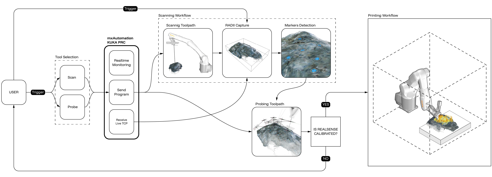
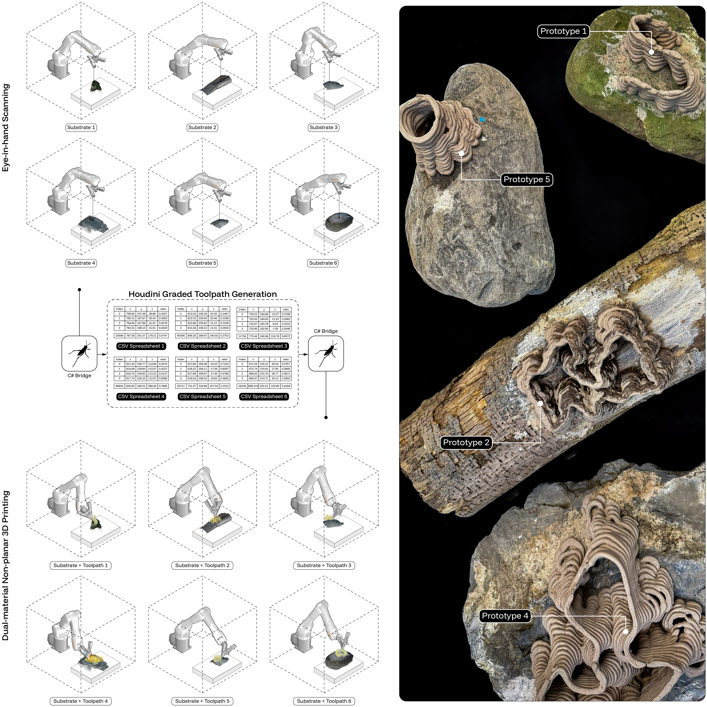
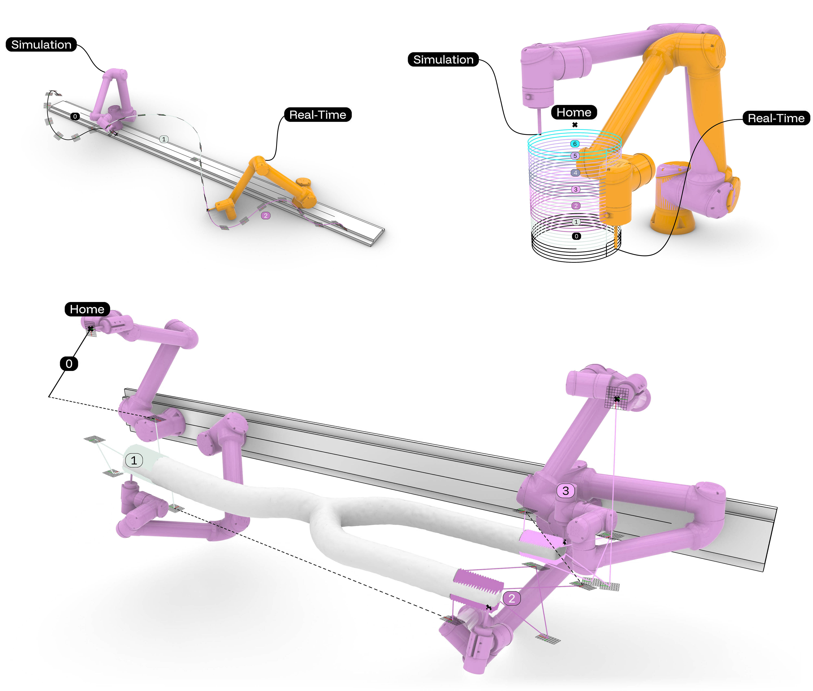
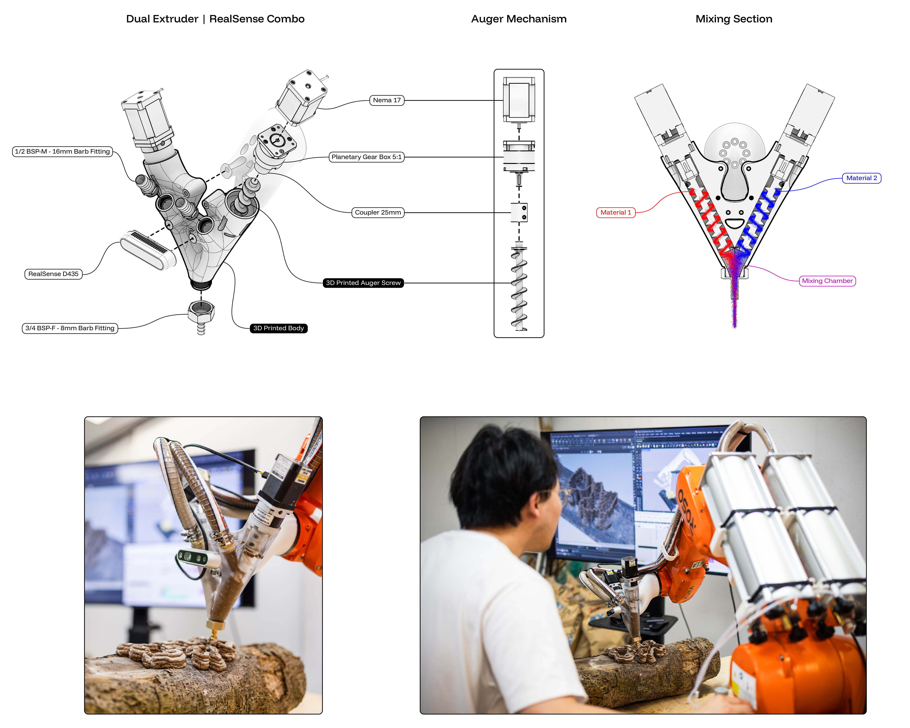
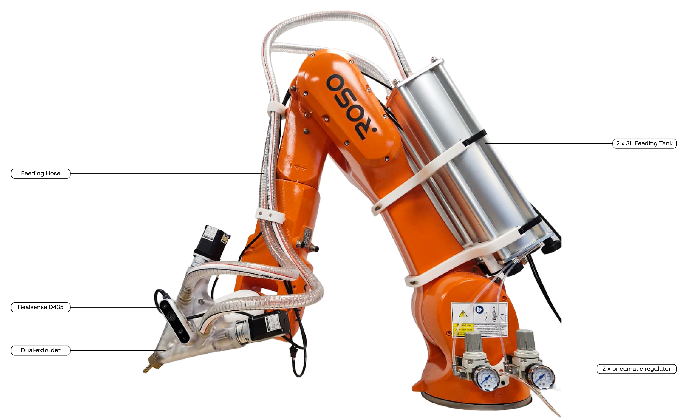
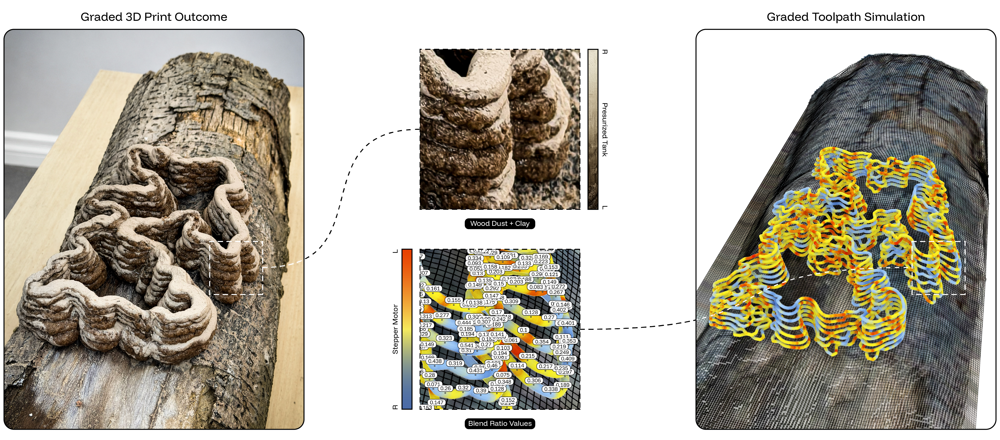

# Chapter 7 — Situated Robotic Fabrication as Feedback Continuum

The final experimental workflow extends the design-to-fabrication
continuum from pre-fabrication coordination into a process that remains
connected during robotic execution. The chapter develops from Robotic
Scan-to-Sequence: Adaptive 3D Printing Toolpathing on Irregular
Substrates and its subsequent workshop implementation, Sequenced Robotic
Toolpaths: 3D Scanning and Bio-Printing on Organic Topology (Urroz et
al., 2026). Together, these related implementations investigate how
scanning, registration, procedural modeling, non-planar toolpathing,
robot-state communication, program sequencing, and graded material
control can remain linked across successive fabrication operations.

The workflow was tested through two complementary robotic ecosystems
rather than one identical hardware setup. The initial scan-to-sequence
research used a Universal Robots UR10e, the Robots plug-in (Soler &
Huyghe, 2016), and RTDE communication to connect eye-in-hand scanning,
computational modeling, live robot-state feedback, and sequential
program execution. A later KUKA KR10 implementation used KUKA\|prc Pro
and mxAutomation, adding a scan–probe calibration loop and a custom
dual-material extrusion system. Their technical protocols differ, but
both address the same practical problem: information produced during one
operation must be available to the next. The scan must be positioned
before the mesh can guide form generation, calibration must be checked
before printing, and robot-state data must confirm when the following
program can begin.

Feedback in this chapter operates primarily between successive workflow
stages and robot programs. The systems do not continuously rewrite robot
trajectories at servo frequency, autonomously redesign the printed form,
or measure and correct material flow during deposition. Instead, the
scan updates the spatial model; probing checks whether the scan and
nozzle correspond physically; the registered mesh guides geometry and
tool orientation; robot-state data triggers the next program; and analog
signals change the relative speed of the two extrusion motors. The user
verifies each transition before the process continues. The contribution
is therefore a situated and semi-automated fabrication workflow rather
than a fully autonomous closed-loop system.

## 7.1 From Linear Robotic Fabrication to Continuous Feedback

Robotic fabrication in architecture is commonly organized through
offline programming. Geometry is developed in a computational
environment, converted into toolpaths, simulated, exported as a machine
program, and executed after the robot and workpiece have been
calibrated. This structure is effective when stock geometry, material
behavior, fixture position, tool frames, and workspace conditions remain
stable. It becomes restrictive when the substrate is irregular, its
position is uncertain, sensor and nozzle frames require repeated
verification, material flow varies, or long operations must be divided
into shorter conditional sequences.

The limitation is not only geometric but procedural. The digital model
represents the expected position of the substrate, tool, and robot
before fabrication begins. During setup and execution, the actual scan,
tool alignment, controller state, and material flow may differ from that
expectation. In an offline workflow, these differences are usually
corrected outside the active program, either before execution through
additional setup or after an error has already occurred.

A feedback continuum keeps these operations connected. The scan
establishes the geometry and position of the substrate. The probing
routine checks whether the scan corresponds to the physical nozzle
position. The registered mesh is then used to generate the form and
orient the deposition targets. Finally, the robot-state variable
confirms when one program has ended so that the next can be uploaded.
Fabrication is therefore organized as a sequence in which each operation
supplies information required by the following one.

The approach builds on architectural robotics research that repositioned
industrial arms as flexible fabrication systems capable of
non-repetitive movement, material experimentation, and process-based
construction (Braumann & Brell-Cokcan, 2012; Gramazio et al., 2014).
Many such systems nevertheless retain an offline sequence: paths are
generated, simulated, exported, and verified through machine execution.
Situated fabrication addresses this remaining discontinuity by
preserving selected information between successive stages.

Feedback is distributed among different participants and technical
systems. Human judgment establishes constraints and evaluates
calibration; the camera captures spatial conditions; computational
procedures filter, mesh, and organize data; the robot executes scanning
and deposition motion; the controller reports state; and the material
responds through flow, adhesion, deformation, and resistance. This
distribution corresponds to accounts of symbiotic robotic fabrication in
which agency emerges through coordination among human, computational,
machinic, and material operations rather than through unilateral machine
control (Nahmad Vazquez & Jabi, 2017).

The interface through which these operations are observed is
methodologically important. Interactive robotic research has shown that
sensing and visualization can make industrial robot behavior more
legible to designers and operators (Braumann & Singline, 2021; Gannon,
2018). In the present workflow, simulated targets, home positions, live
TCP poses, program lists, calibration status, and material outputs
remain visible within Grasshopper and Rhino. This does not remove the
need for safety procedures or technical expertise. It allows the user to
understand whether the system is simulating, scanning, probing,
printing, paused, or preparing the next operation.

“Continuous” feedback does not mean that scanning, modeling, probing,
and printing occur simultaneously. The scan occurs before form
generation, the probe path is created only after the markers have been
detected, and one robot program must end before the next begins. The
continuity lies in the fact that these stages do not become disconnected
files: the scan generates the probe targets, the probe result determines
whether printing can begin, and the robot state determines whether the
next program is sent.

This distinction defines the scope of the research. The robot does not
independently determine design intention, evaluate print quality, or
change deposition from live material sensing. The user selects the
substrate, defines the geometric constraints, confirms calibration,
chooses the process parameters, and intervenes when robot motion or
material flow becomes unreliable. The system shortens the separation
between design and execution while keeping each decision visible to the
user.

## 7.2 Scan-Probe Registration and Situated Calibration

The workflow begins with an irregular substrate positioned directly
within the robot's working envelope. Rocks and logs function as situated
surfaces rather than as catalogued parts whose geometry and placement
are known before setup. Their local shape must be captured, related to
the robot coordinate system, and verified before non-planar deposition
can proceed. This differs from Chapter 6, where timber forks were
scanned, catalogued, and later positioned for milling. Here, the
physical placement itself becomes part of the computational scene.

The initial UR10e implementation used an Intel RealSense D435 depth
camera mounted eye-in-hand with the extrusion system. A predefined
scanning routine moved the camera around the substrate while the robot's
current TCP transformation located successive point clouds in the robot
coordinate system. Live joint and TCP data were received through RTDE.
The point clouds captured from the different robot positions were
transformed into the robot coordinate system, filtered to remove
unwanted points, merged, and converted into a mesh. This mesh was then
used directly to generate the printed geometry and non-planar toolpath,
eliminating the need to reconstruct the substrate as a simplified CAD
model and then realign that model virtually. This preserved both the
substrate's local geometric details and its accurate position in the
robot workspace (Breseghello et al., 2023; Nicholas et al., 2020; Zamani
et al., 2023).

The later KUKA implementation introduced an explicit scan–probe
calibration loop. A key challenge in this workflow was calibrating the
relationship between the RealSense camera and the robot tool coordinate
system. The extruder TCP was calibrated using the KUKA four-angle tool
calibration wizard on the teaching pendant. However, calibrating the
RealSense TCP was less direct. The position of the camera in the
three-dimensional model did not always correspond precisely to its
actual sensing position, likely because of slight variations in the
camera intrinsics and physical mounting tolerances.

To address this issue, an iterative calibration workflow was developed
using blue dot markers placed on the substrate. The purpose of the
workflow was to align the scanned point cloud with the actual position
of the substrate in the robot workspace. The calibration proceeded
through a repeated scan-and-probe loop (Figure 7.1).

<figure id="figure-7-1" class="dissertation-figure">
  <a class="figure-link" href="../figure/figure-7-1.jpeg" data-figure-src="figure/figure-7-1.jpeg" data-figure-number="Figure 7.1." data-figure-caption="Scan–probe–print feedback workflow. The user selects either a scanning or probing sequence. Through mxAutomation and KUKA\|prc, the robot sends motion programs, receives live TCP feedback, captures the substrate through the RealSense camera, detects physical markers, generates probing targets, and loops until the RealSense tool frame is calibrated before moving to the printing workflow.">
    
  </a>
  <figcaption><strong>Figure 7.1.</strong> Scan–probe–print feedback workflow. The user selects either a scanning or probing sequence. Through mxAutomation and KUKA\|prc, the robot sends motion programs, receives live TCP feedback, captures the substrate through the RealSense camera, detects physical markers, generates probing targets, and loops until the RealSense tool frame is calibrated before moving to the printing workflow.</figcaption>
</figure>

The user first selects between two operational modes: Scan and Probe. On
the first iteration, a probe path cannot yet exist because its targets
depend on features detected in the scan. The scan sequence is therefore
sent to the KUKA KR10 through the mxAutomation component in KUKA\|prc
Pro. When the robot reaches a designated capture position, the RealSense
acquisition is triggered.

The current KUKA TCP pose is returned to Rhino/Grasshopper and used to
transform the point cloud into the digital robot scene. The cloud is
filtered to remove irrelevant points and then reconstructed as a mesh.
The process is kept comparatively direct: capture, transform, filter,
mesh, and pass the geometry to the next operation. Extensive manual
remeshing or reconstruction as a smooth solid is avoided because the
purpose is to preserve the actual local topology on which printing will
occur.

Temporary blue markers are placed on the physical substrate before
scanning. A custom C# image-processing helper identifies the blue
regions and creates Rhino points at their reconstructed centers. The
markers function as shared physical and digital references. They are not
used to catalogue the substrate; they provide known locations against
which the extrusion TCP can be checked.

For each detected point, the closest mesh location and local surface
normal are found. A target plane is created at the marker center with
its axis oriented relative to that normal. Approach and retraction
positions are added so that the nozzle can move toward the marker
without immediately colliding with the substrate. These targets become
the probe program. The probe sequence is then transmitted through
mxAutomation. The robot moves the extrusion TCP toward each physical
marker while the user observes whether the nozzle aligns with the
visible center. If digital and physical locations correspond within the
practical tolerance required for the first deposited layer, the
calibration is accepted. When an offset remains, the user measures or
estimates the deviation, modifies the RealSense tool-frame definition,
and repeats the scan–probe sequence.

This iterative process allowed the RealSense tool position to be
corrected without requiring a fully automated hand–eye calibration
procedure. It was intentionally designed as a practical workshop
workflow in which visual verification and user adjustment could provide
sufficient accuracy for conformal printing.

The procedure remains semi-automated. Marker detection, target
generation, data transformation, and robot communication are
computationally structured, but the user assesses physical
correspondence and decides when the offset is acceptable. No force
sensor or automated contact routine measures the residual error. The
system produces practical deposition registration rather than certified
metrological accuracy.

Once the camera-to-tool relation is verified, the sequence can be
repeated for different rocks or logs. Each substrate is positioned,
scanned, meshed, and passed directly into the modeling workflow. Its
actual surface geometry is then used to generate the printed form,
orient the nozzle, and locate the first deposited layer. The substrate
can therefore affect the toolpath rather than serving only as a support
for a predetermined object.

## 7.3 Direct Mesh-to-Toolpath Modeling

After calibration, the registered substrate mesh was used directly for
digital modeling and toolpath generation. This avoided rebuilding the
rock or log as a simplified CAD model and then trying to realign that
model with the physical substrate. Using the scan directly preserved
both the local geometric details of the surface and its position in the
robot workspace.

During the workshop, participants could follow two digital modeling
routes. The first remained entirely within Rhino and Grasshopper. The
scanned mesh was used as the base for generating organic geometries,
including differential-growth patterns developed directly on the
substrate. Because the geometry was generated on the scan, it followed
the curvature and position of the actual rock or log rather than being
modeled separately and placed on it afterward.

The resulting geometry was then contoured using a non-planar logic in
Grasshopper. Instead of intersecting the form with horizontal planes,
the contouring process extracted curves that followed its changing
height and orientation, consistent with other conformal fabrication
approaches developed for irregular or reusable substrates (Sader et al.,
2026). These curves were divided into ordered points and converted into
robot targets. This route produced a single-material toolpath and did
not include texture-based material gradation.

The generated forms still had to be checked before fabrication.
Differential-growth patterns could create narrow branches, steep
overhangs, abrupt directional changes, or regions where successive
deposited strands would not be sufficiently supported. Participants
therefore adjusted the geometry, path continuity, and contour spacing
before converting the curves into robot targets.

The second computational strategy uses a Grasshopper–Houdini bridge.
After the substrate mesh was generated in Grasshopper, it could be
exported to Houdini for procedural form generation. A growing geometry
structure was generated on the scanned surface, treating the substrate
as an active terrain for growth rather than as a neutral base. The
resulting geometry was then contoured non-planarly, and the ordered
waypoint data with its corresponding gradient data was exported back to
Grasshopper through a CSV file. Custom C# helpers acted as bridges
between the two environments, allowing the workflow to move from robotic
scanning to procedural modeling and back to robotic target generation
(Figure 7.2).

<figure id="figure-7-2" class="dissertation-figure">
  
  <figcaption><strong>Figure 7.2.</strong> Sequential scan-to-print workflow across multiple substrates. Eye-in-hand scanning captures different rock and log substrates, which are transferred through a Grasshopper–Houdini bridge for graded toolpath generation and then returned to Grasshopper as fabrication-ready robot targets for dual-material non-planar printing.</figcaption>
</figure>

For both routes, the non-planar contours were ultimately converted into
robotic targets in Grasshopper. Each contour was divided into ordered
points, and a target plane was generated at every point using the
closest surface normal. This kept the nozzle approximately perpendicular
to the local surface while following the changing path.

Normals extracted from the scanned or generated mesh could change
abruptly because of local noise, uneven triangulation, or sudden changes
in surface direction. To avoid unstable robot rotation, the target
orientation was smoothed along the path while remaining close to the
local surface normal. This reduced abrupt changes between consecutive
targets and helped maintain more continuous deposition.

The target sequence also included the commands required for fabrication.
Start and stop values controlled extrusion at the beginning and end of
each curve. Approach and retraction targets were inserted where the
robot had to move between separated paths without dragging material
across the substrate. Initial layers could be printed more slowly to
improve adhesion to the irregular surface.

In the Grasshopper-only route, each target contained its position,
orientation, sequence, and a single-material extrusion command. In the
Houdini route, each target also retained the intensity value imported
through the CSV file. Grasshopper mapped this value to two analog
outputs controlling the relative speed of the dual-extrusion motors. The
same ordered target list therefore controlled the robot motion, nozzle
orientation, extrusion state, and, when the Houdini workflow was used,
the relative contribution of the two materials.

## 7.4 Robotic Sequencing Through RTDE and mxAutomation

The feedback continuum developed in this chapter depends not only on
scanning, mesh generation, and non-planar toolpathing, but also on how
robotic actions are organized and transmitted. In conventional robotic
fabrication, the computational model often produces one complete program
that is sent to the robot as a fixed sequence. The entire toolpath, tool
state, and fabrication order must therefore be resolved before execution
begins. The workflow developed here instead divides fabrication into
smaller program-level operations that can be triggered, monitored, and
updated through feedback.

This is especially important for situated fabrication because the next
robotic action may depend on the result of a previous operation. A scan
must occur before a probe path can be generated. Probing must confirm
calibration before printing can begin. A long toolpath may need to be
divided into shorter programs. A target group may require a new rail or
robot-base position before it becomes reachable. A paused extrusion
sequence must stop both robot motion and material flow, then restore
both when execution resumes. Fabrication is therefore organized as a
chain of conditional operations rather than as one complete file sent to
the machine.

This logic was tested through two robotic communication environments:
RTDE for Universal Robots and mxAutomation for KUKA robots. The
protocols are technically different and belong to separate controller
ecosystems. Within this research, however, both keep Grasshopper
connected to the robot during execution. They allow robot-state
information and live TCP data to return to the computational model and
support decisions about which program should be sent next. This approach
is consistent with recent work on open and multimachine robotic
communication in architecture (Pacheco, 2024).

RTDE, or Real-Time Data Exchange, reads and writes selected variables
through the Universal Robots controller. In this workflow, RTDE was used
mainly for monitoring, while program upload and execution remained under
the Robots control interface (Soler & Huyghe, 2016). Programs generated
through Robots were sent through the UR Secondary Interface on port
30002. Supervisory commands, including run, stop, and protective-stop
recovery, used the Dashboard Server on port 29999. A custom C# RTDE
client connected on port 30004 and streamed selected values,
particularly runtime_state and actual_TCP_pose.

Rather than sending one large program, the toolpath was divided into
multiple UR programs, each representing one segment of the fabrication
task. A custom Remote_Sequence component, developed from the original
Robots Remote component, received the ordered program list and uploaded
the files one after another. When runtime_state returned the Stopped
condition, the component interpreted this as the completion of the
current segment and sent the next program.

The cue loop followed this sequence:

Program N runs → RTDE reports Stopped → Remote_Sequence uploads Program
N+1 → execution continues.

This allowed long or complex toolpaths to be divided into manageable
segments without losing continuity at the workflow level. During
testing, remotely uploaded programs were kept below an observed limit of
approximately 2,500 targets because larger programs became less
reliable. Segmentation also made it possible to inspect, rerun, or
replace one part of the process without regenerating the complete
toolpath.

The same RTDE structure also supports real-time digital twin feedback.
The actual_TCP_pose streamed from the robot can be fed back into the
computational environment to visualize the live position of the robot
geometry in Rhino (Figure 7.3). The visualization did not correct the
robot motion. It allowed the user to distinguish among a simulated
future operation, the program currently being executed, and the robot's
actual position.

<figure id="figure-7-3" class="dissertation-figure">
  
  <figcaption><strong>Figure 7.3.</strong> Simulation and real-time robotic feedback interface. The computational model maintains both simulated and real-time representations of robot motion, allowing toolpath sequences, home positions, and live robot states to be visualized within the design environment.</figcaption>
</figure>

A second custom component, Write AO, extended this sequencing logic to
extrusion control. Pausing the robot did not automatically guarantee
that the auger or another analog-controlled tool would stop. Write AO
monitored the active analog outputs, stored their current values, and
temporarily set them to zero when the process was paused. When execution
resumed, it restored the previous values. This kept robot motion and
material flow synchronized and prevented material from accumulating
while the TCP remained stationary.

The RTDE workflow also demonstrated that sequencing could respond to
geometry rather than only to robot state. In the rail-milling example,
the Universal Robot operated in relation to a Vention linear rail that
was not configured as a coordinated seventh axis. The robot could
therefore not solve a continuous TCP path while its base moved along the
rail.

The toolpath was divided into target groups. For each group, the
computational model calculated a rail position that placed the targets
within the robot's reachable workspace. A Vention URCap move command was
inserted into the corresponding UR program, and the robot-base
transformation was updated in Grasshopper before execution. The sequence
became:

retract TCP → compute and move to rail position → update robot base →
execute target group → cue the next program.

Retraction was required to clear the workpiece before the rail moved.
The rail motion also had to finish before the robot began the local
toolpath. The system therefore extended the workspace through sequential
repositioning rather than coordinated external-axis motion.

The required URCap commands were first generated on the teaching
pendant, saved, and inspected before being reconstructed as
parameterized commands in Grasshopper. The Vention installation block
also had to be included. During testing, a basic move command could
execute without it, but the home command failed to detect the end stop
and continued running. This showed that vendor initialization code was
part of the executable workflow and had to be documented rather than
treated as an invisible controller setting.

The KUKA/mxAutomation workflow operated through a different technical
environment but followed the same program-level logic. KUKA\|prc Pro
provided a dedicated mxAutomation component for sending scan, probe, and
print paths from Grasshopper to the KUKA KR10 while returning live TCP
information to Rhino (Braumann & Brell-Cokcan, 2012).

The live TCP pose was essential during scanning. When the robot reached
the capture position, the current pose was used to transform the
RealSense point cloud into the correct position in the digital robot
scene. The robot position therefore connected the physical camera
capture to the registered mesh used for toolpath generation.

mxAutomation also supported the scan–probe calibration loop. During the
first pass, only the scan path was available because the probe targets
depended on the markers detected in the scanned mesh. After marker
detection, Grasshopper generated the probe planes and sent the probe
path to the robot. If the extrusion TCP aligned with the physical
markers, the workflow could proceed to printing. If it did not, the user
adjusted the RealSense tool frame and repeated the scan and probe
sequence.

The next operation was therefore selected differently in each setup. In
the RTDE workflow, the next program was triggered by the robot's
execution state. In the rail workflow, it depended on the target group's
geometric relation to the rail position. In the KUKA workflow, it
depended on whether scanning had produced the probe targets and whether
the user confirmed the calibration. Sequencing refers here not only to
playing programs in order, but to defining the condition under which
each program can begin.

Program-level sequencing also addressed practical controller
limitations. Large robotic toolpaths could exceed upload or
communication limits, so dividing them into smaller programs improved
reliability. Rail-based workflows could be decomposed into reachable
groups. Scan–probe workflows could alternate between sensing and
verification without moving to a separate calibration environment.
Extrusion programs could preserve their analog-output state through
pauses and resumes.

The approach should not be confused with fully autonomous robotic
control. The robot does not decide what to fabricate, and the system
does not rewrite trajectories continuously at the servo level. It
structures fabrication as a semi-automated sequence in which human
decisions, computational inputs, robot states, and tool commands remain
connected. This makes the workflow more adaptable than a single offline
program while keeping the process legible and controllable for the user.

RTDE and mxAutomation therefore complete the feedback structure
developed in the preceding sections. Scan–probe registration establishes
the spatial relation among the robot, sensor, nozzle, and substrate.
Mesh-based toolpathing converts the registered geometry into robot
targets. Program-level sequencing then organizes those targets into
operations that can be monitored, triggered, paused, resumed, or
repeated according to the state of the workflow.

## 7.5 Graded Non-Planar Bio-Material Deposition

The previous sections established how the workflow registers an
irregular substrate, generates non-planar robot targets, and organizes
robotic operations through live communication protocols. The same target
structure was then extended to material control. Each target defined not
only the position and orientation of the nozzle, but also two analog
output values that controlled the relative speed of two extrusion
motors. The robotic path therefore carried both spatial and material
instructions.

This approach responds to a broader shift from homogeneous fabrication
toward graded material deposition. In conventional extrusion, geometry
is usually defined first and printed with one material at a relatively
constant setting. Research on material ecology and functionally graded
fabrication instead treats material distribution as part of the design
process, linking geometry, composition, fabrication parameters, and
performance (Oxman, 2012). Bio-based fabrication research similarly
shows that heterogeneous materials require workflows that connect
material behavior with computational and environmental data (Ramsgaard
Thomsen & Tamke, 2022; Wei et al., 2025).

The workshop tested this principle through a dual-material extrusion
system. The objective was not to produce a fully characterized
construction material or an exact compositional gradient. It was to
determine whether scalar values attached to non-planar robot targets
could control two paste streams while printing on a scanned substrate.
Two pressurized material supplies fed two auger-driven channels that
converged in a common mixing section. By varying the motor speed of each
channel along the path, the workflow could gradually alter the
contribution of each material without stopping the print or changing
cartridges between operations.

The custom end-effector combined this dual extruder with the Intel
RealSense D435 used for scanning (Figure 7.4). Each extrusion channel
used a NEMA 17 stepper motor coupled to a 5:1 planetary gearbox and
connected to a 3D-printed auger screw. The gearbox increased the torque
available at the auger and provided finer speed control than a direct
motor connection.

The extruder body and augers were fabricated through SLA resin printing.
Clear resin was used for the body so that users could observe the two
material streams entering the augers, passing into the mixing section,
and leaving through the nozzle. This visibility was important during
testing because uneven pressure, air pockets, clogging, or differences
in paste consistency could otherwise remain hidden inside the tool. The
transparent body therefore functioned as both a mechanical housing and a
diagnostic interface.

<figure id="figure-7-4" class="dissertation-figure">
  
  <figcaption><strong>Figure 7.4.</strong> Dual-extruder and RealSense end-effector. The custom end-effector integrates two auger-driven bio-paste extruders with an Intel RealSense D435 depth camera. The transparent body allows material flow and mixing behavior to be visually monitored during fabrication.</figcaption>
</figure>

The two material inlets used 16 mm hose-barb fittings with 1/2-inch BSP
male threads. The outlet accepted interchangeable 3/4-inch BSP female
fittings connected to 6, 8, or 10 mm barb nozzles. The nozzle size could
therefore be adjusted according to the particle size and flow behavior
of the paste. Larger hoses and fittings were selected because the
viscous materials had to travel through long feeding lines from the
pressure tanks to the moving end-effector. Narrow tubing increased
pressure loss and clogging risk, while the larger fittings also matched
the outlet dimensions of the WASP tanks.

The complete setup included two WASP 3 L pressurized tanks mounted
behind the KUKA robot, two pneumatic regulators, long feeding hoses, the
dual extruder, the RealSense camera, and a custom electronic controller
(Figure 7.5). Each material was stored in a separate tank and supplied
to one side of the extruder. Tank pressure moved the bulk material
through the hoses, while the augers controlled the local discharge near
the nozzle. This division allowed the pressure system to overcome hose
resistance while preserving finer motor-based control at the
end-effector.

<figure id="figure-7-5" class="dissertation-figure">
  
  <figcaption><strong>Figure 7.5.</strong> Robotic setup for dual-material non-planar deposition. The setup combines a KUKA robotic arm, two pressurized feeding tanks, pneumatic regulators, feeding hoses, a RealSense D435 camera, and a dual-material extrusion end-effector for graded deposition on irregular substrates.</figcaption>
</figure>

Pressure and auger speed had to be tuned together. Excessive tank
pressure could continue pushing material even when an auger slowed,
while insufficient pressure could starve the auger and interrupt the
flow. Because clay and wood-dust paste had different viscosities,
identical motor commands did not necessarily produce equal discharge
from both channels. The working pressure and motor-speed range therefore
had to be established physically before the gradient values were
embedded in the robotic program.

The electronic controller duplicated the motor-control chain for the two
extrusion channels. Two TB6600 drivers controlled the NEMA 17 motors and
were connected to an ESP32. The KUKA controller required additional
analog-output hardware, which was installed through a Beckhoff EL4004
terminal. The terminal provided four 0–10 V analog output channels at
12-bit resolution, two of which were used to control the extrusion
motors independently.

Each robot target carried two analog values in addition to its position
and orientation. These values were transmitted through the KUKA control
system to the ESP32 and motor drivers, where the voltage was translated
into relative motor speed. As the scalar value changed along the
toolpath, one motor could accelerate while the other decelerated.

A browser-based interface provided a second mode of control. Two sliders
communicated with the ESP32 through USB serial and allowed the motor
speeds to be tested or overridden without running a complete robot
program. Before printing, users adjusted the sliders while observing the
material flow through the transparent extruder. This made it possible to
identify a range that produced continuous extrusion without excessive
pressure, starvation, or clogging. The computational gradient was then
mapped into this tested range. Manual tuning and robotic control were
therefore successive stages of the same process rather than separate
approaches.

The graded toolpath was generated through the
Grasshopper–Houdini–Grasshopper workflow described in Section 7.3. The
registered substrate mesh was transferred from Grasshopper to Houdini,
where the organic geometry and non-planar contours were generated. Color
or texture variation from the scanned substrate was sampled and
converted into scalar intensity values ranging from 0 to 1. The ordered
XYZ coordinates and their associated intensity values were exported as a
CSV file and imported back into Grasshopper.

In Grasshopper, each point was converted into a robot target by
constructing a plane oriented according to the closest surface normal.
The scalar value attached to the point was then mapped to the two analog
outputs. A simple inverse relationship could increase the speed of one
motor while decreasing the other. The target therefore contained its
position, orientation, path sequence, and the two motor-control values
required for graded deposition (Figure 7.6).

<figure id="figure-7-6" class="dissertation-figure">
  
  <figcaption><strong>Figure 7.6.</strong> Graded non-planar toolpath simulation and printed outcome. Texture-derived intensity values are translated into blend-ratio values along the toolpath, controlling the relative extrusion speeds of the two auger motors and producing a graded clay and wood-dust deposition on the scanned substrate.</figcaption>
</figure>

The two analog values represented commanded motor speeds, not calibrated
volumetric mixture ratios. The physical blend depended on tank pressure,
paste viscosity, hose resistance, auger filling, backpressure, nozzle
diameter, and the time required for material to travel from the mixing
section to the outlet. A change in the digital value could therefore
appear later in the deposited bead or differ from the intended
proportion. The experiment demonstrated graded co-deposition and visible
material variation, but not chemically precise compositional control.

Clay was loaded into one pressure tank, while the second contained an
experimental wood-dust paste. The paste was developed to test flow,
blending, and dual-material deposition rather than as a finalized
architectural material. Its composition is summarized in Table 7.1.

Table 7.1: Experimental
wood-dust paste recipe used for dual-material robotic extrusion, with an
estimated final yield of approximately 1 L.

| **Component**    | **Amount** | **Function**          |
|------------------|------------|-----------------------|
| Water            | 600 g      | Base liquid           |
| Wood Dust        | 315 g      | Filler                |
| Glycerine        | 200 g      | Plasticizer           |
| Xanthan Gum      | 75 g       | Rheology modifier     |
| Calcium Chloride | 50 g       | Crosslinking additive |

The formulation was sensitive to the granulometry of the wood dust and
the pressure conditions of the feeding system. Coarse or inconsistent
particles increased the risk of clogging and changed the response of the
auger. Water provided the liquid phase, wood dust acted as the primary
filler, glycerine improved workability, and xanthan gum increased
viscosity and helped stabilize the paste during extrusion. Calcium
chloride was included as an experimental additive intended to support
material consistency.

The quantities document the mixture used during the workshop and should
not be treated as a standardized recipe. The paste was not characterized
through rheometry, mechanical testing, shrinkage measurement, adhesion
testing, water exposure, durability analysis, or biodegradation studies.
Successful extrusion therefore demonstrated printability, not structural
or architectural performance. Research on mechanically tunable
cellulose-based composites reinforces the need to connect material
formulation and extrusion behavior with measured properties rather than
infer performance from deposition alone (Mogas-Soldevila et al., 2026).

The experiment also exposed a computational limit. Increasing the
resolution of the material gradient required more robot targets and more
frequent analog-output changes. When too much information was
transmitted through mxAutomation, the robot could stop unpredictably
after reaching the practical limit of transmissible program lines. The
toolpath and gradient therefore had to be simplified. This demonstrated
that the resolution of material variation depended not only on the
extrusion hardware, but also on controller capacity, communication
bandwidth, and program structure.

The system did not measure the actual amount of material leaving either
channel. Flow was evaluated visually through the transparent extruder
body and from the printed result. The program could command two motor
speeds, but it could not confirm the resulting blend ratio, bead width,
or the presence of a partial blockage. Material behavior entered the
workflow through human observation and adjustment rather than through
automatic sensor feedback.

The result is therefore best described as graded non-planar
dual-material deposition rather than fully controlled functionally
graded material fabrication. The workflow established a direct path from
substrate texture to scalar values, from scalar values to robot targets,
and from robot targets to two independently controlled extrusion
channels. It also identified the additional sensing, calibration, and
material characterization required for more precise compositional
control. The same approach could later be applied to sargassum-based
composites, clay mixtures, recycled fibers, or other bio-based pastes
whose behavior varies with moisture content, particle size, binder
ratio, or environmental performance requirements. Such variation should
not automatically be treated as a defect. It can become a fabrication
parameter, provided that material sensing, toolpath generation, hardware
control, and communication remain connected within the same workflow
(Palma, 2023).

## 7.6 Contribution to the Design-to-Fabrication Continuum

Situated robotic fabrication converts the continuum from a
pre-fabrication coordination model into a sequence that remains
revisable during execution. Four operations substantiate this extension:
scan–probe registration aligns physical and digital space; mesh-based
modeling derives geometry and orientation from the situated substrate;
RTDE and mxAutomation organize conditional program sequences; and
dual-channel analog control embeds variable material instructions in
robot targets.

The technical difficulties are part of this contribution. Camera, tool,
and robot frames accumulated offsets; raw mesh normals produced unstable
orientations; CSV exchange required consistent point order and
transformations; remote program limits required path segmentation; the
Vention rail could not function as a coordinated seventh axis;
pause/resume logic had to preserve analog outputs; mxAutomation limits
reduced gradient resolution; and pressure, rheology, hose resistance,
and auger response prevented analog values from corresponding directly
to exact material ratios. These problems reveal where a nominally
continuous digital workflow breaks and what additional structures are
required to restore continuity.

Relative to the methodological criteria established in Chapter 3, the
workflow demonstrates strong operational integration across sensing,
registration, modeling, toolpath generation, robot communication, and
extrusion control. Feedback responsiveness is demonstrated at the
workflow and program levels through scan–probe iteration, robot-state
cueing, live TCP visualization, conditional sequencing, and human
validation. It does not yet include continuous sensing and correction of
material deposition or servo-level path adaptation.

Methodological legibility is supported by visible program states,
explicit calibration stages, custom Grasshopper components, documented
communication channels, hardware specifications, and open-source
definitions. Transferability remains bounded by robot-specific
protocols, controller options, plug-in versions, analog hardware,
end-effector fabrication, safety infrastructure, and the expertise
required to configure them.

The workflow's situated ecological relevance lies in its ability to
fabricate directly on irregular existing substrates and to test
bio-based pastes without first standardizing geometry. This potential
does not establish an ecological benefit by itself. The KUKA and UR
systems, pressurized tanks, electronics, resin-printed end-effector,
energy consumption, material formulation, waste, durability, and future
separation or reuse all require wider assessment.

The chapter therefore contributes neither a fully autonomous robot nor a
validated graded biomaterial. It contributes a technical and
methodological framework in which physical capture, computation, robotic
state, and material commands remain connected long enough for the next
operation to respond to the previous one. The continuum becomes temporal
and situated: accuracy is constructed through repeated alignment,
fabrication is organized through conditional sequences, and material
variation is encoded as part of the toolpath while remaining open to
human observation and correction.
