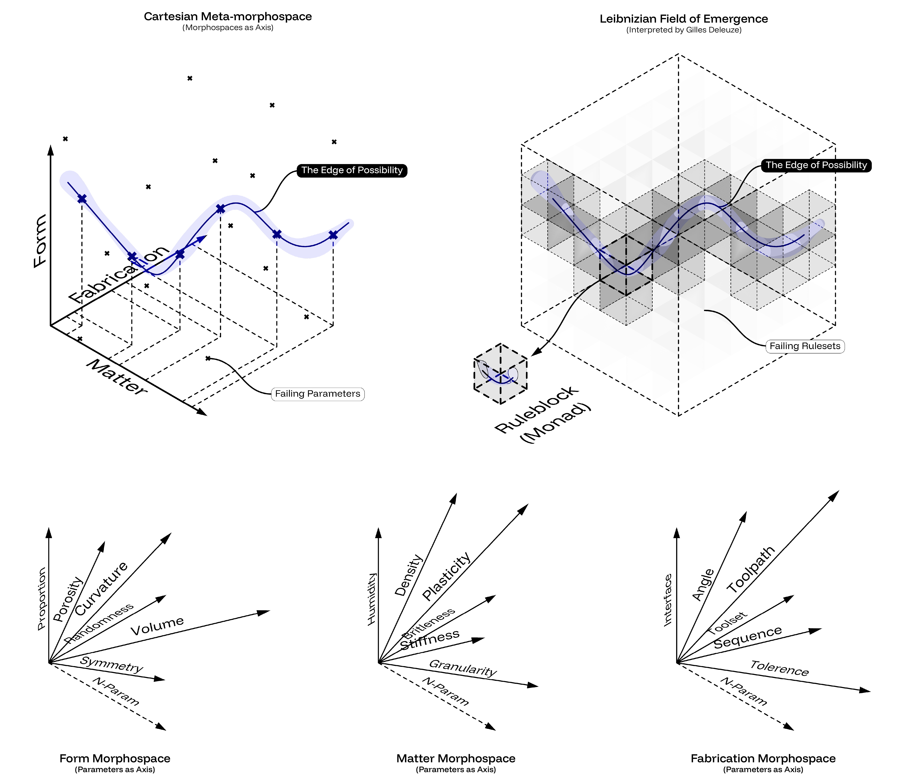
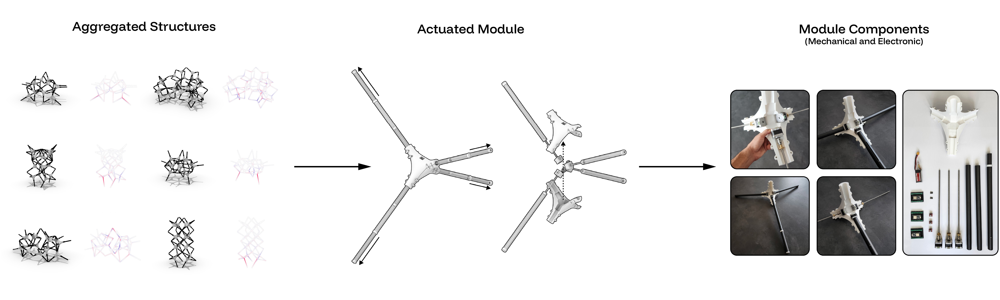
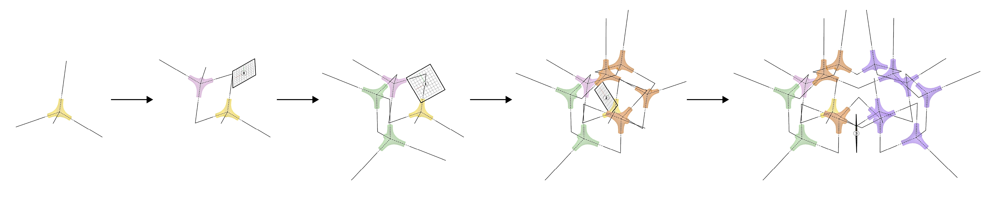
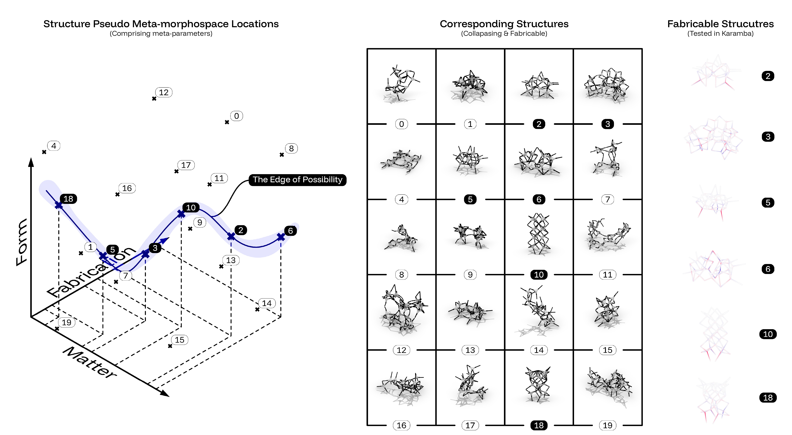

# Interlude I — Morphogenesis at the Edge of Possibility

This interlude occupies the conceptual and experimental threshold
between the environmental translation developed in Chapter 4 and the
material fabrication logic developed in Chapter 5. It examines
morphogenesis not as the unrestricted generation of digital form, but as
a bounded design-to-fabrication problem in which geometry, structure,
material behavior, actuation, and assembly progressively narrow the
field of possibility. Its purpose is to clarify how computational
variation becomes architecturally meaningful only when the conditions of
viability are made explicit.

The project Adaptive Assemblies in Meta-Morphospace tests this
proposition through a speculative kit-of-parts composed of adjustable
tetrapod modules. Computational aggregation, stochastic variation,
structural analysis, actuator range, and manual assembly are brought
into relation to identify the limited subset of configurations that can
remain coherent and constructible. The interlude therefore introduces
bounded emergence as a bridge between ecological feedback and machinic
constraint: possibility is not eliminated by fabrication limits, but
organized through them.

## I.I From Form Generation to Morphogenetic Fields

Computational design is often evaluated by the quantity and diversity of
forms it can generate. Parametric models can produce large families of
differentiated geometries through sliders, associative dependencies, and
reversible relationships. Yet the multiplication of alternatives does
not by itself explain how a field of possibility is structured, which
variations remain viable, or where geometric freedom encounters
material, structural, and fabrication limits. Morphogenesis is therefore
treated here not as formal proliferation, but as the emergence of form
through relations among geometry, matter, structure, fabrication, and
feedback.

This shift moves attention from the isolated object toward the field as
an operational condition. Field conditions describe architectural order
through local interactions and relational rules rather than through one
dominant compositional figure (Allen, 1997). Under this model, the
designer does not determine every final relation directly. The design
task becomes the construction of parameters, thresholds, and interaction
rules through which configurations can appear, stabilize, mutate, or
fail.

Complexity theory reinforces this distinction. Organized behavior can
arise through nonlinear interaction, local rules, and repeated feedback
rather than centralized command. The productive condition is not
unlimited disorder, but a narrow regime between stability and
instability in which variation remains capable of generating coherent
organization (Waldrop, 1993). Computational models can therefore
function as experimental environments for locating such regimes,
provided that the outcomes are assessed against conditions beyond
geometry alone.

Parametric and emergent systems should nevertheless be distinguished. A
parametric system navigates a predefined design space through explicit
dependencies. It may generate extensive variation while remaining fully
determined by its coordinate system and rules. An emergent system
distributes behavior among interacting units so that global organization
cannot be specified completely in advance. The project Adaptive
Assemblies in Meta-Morphospace occupies the interval between these
models. A bounded parametric field defines allowable relations, while
stochastic variation, local interaction, actuator range, and structural
feedback determine which configurations remain viable.

Control is consequently relocated from the direct prescription of form
to the design of limits. The system does not abandon intention; it
embeds intention in ranges, thresholds, and evaluative procedures.
Geometric freedom is conditioned by allowable member lengths, structural
stability, assembly logic, and fabrication capability. Computation
becomes a probe into the boundary between meaningful variation and
collapse.

## I.II Meta-Morphospace and Field of Emergence

The experiment combines two complementary models: a meta-morphospace and
an emergent field. Morphospace originates in accounts of biological form
as transformation within a continuous geometric field (Thompson, 1917).
Its architectural extension relates form, matter, material system, and
materialization as interdependent conditions (Crolla, 2018). Here, these
relations are reformulated through three intersecting N-dimensional
domains: Form, Matter, and Fabrication.

Form includes topology, geometry, curvature, proportion, and volume.
Matter includes composition and behavioral properties such as stiffness,
plasticity, density, anisotropy, and granularity. Fabrication includes
tooling, assembly sequence, machine or actuator range, angle, tolerance,
and process constraints. Each axis represents a variable capable of
influencing whether a configuration can be produced and remain stable.

Their intersection defines a meta-morphospace in which every coordinate
corresponds to a particular design-to-fabrication configuration.
Viability is not distributed evenly across this field. Some combinations
are geometrically coherent but structurally unstable; others contradict
material behavior, exceed actuator range, or cannot be assembled. A
restricted trajectory through the field defines a line of possibility: a
subset in which geometry, matter, structure, and fabrication remain
mutually compatible.

Within this first model, computation navigates a bounded coordinate
space while simulation or rule-based checks evaluate feasibility.
Variation is enumerated under constraint. The meta-morphospace is
therefore both generative and evaluative: it maps possible
configurations while distinguishing those that remain actionable from
those that exceed the system's capacities.

The emergent-field model describes a different mode of formation.
Instead of selecting one global coordinate, the field is conceptually
discretized into localized rule-bearing units. Variables drawn from the
Form, Matter, and Fabrication domains become local conditions: curvature
thresholds, member-length limits, connection proximity, and structural
gradients are negotiated through interaction rather than imposed as one
complete geometry.

The relation to Leibnizian monads, as interpreted by Deleuze, is
conceptual rather than literal. Each local unit can be understood as
containing an internal rule set, while larger organization arises
relationally through the interaction of those units (Deleuze, 1993). The
implemented workflow remains computationally coordinated rather than
fully decentralized, but the analogy clarifies the shift from a globally
selected configuration toward a field in which local conditions
contribute to global form (Figure I.I).

<figure id="figure-i-i" class="dissertation-figure">
  
  <figcaption><strong>Figure I.I.</strong> Two complementary models of morphogenesis. Top: meta-morphospace and emergent field. Bottom: each domain as an N-dimensional morphospace, highlighting how meta-morphospace parameters correspond to emergent rule-variables.</figcaption>
</figure>

The two models are therefore connected without being treated as
equivalent. Meta-morphospace defines the bounded dimensions of
possibility; the emergent field describes how localized rules may
explore and negotiate those dimensions. Computation shifts from
producing alternatives to testing the thresholds at which formal
variation remains structurally and operationally meaningful.

## I.III Speculative Actuated Aggregation Assemblies

A kinetic kit-of-parts was developed to make this relation physically
testable. The system consists of tetrapod modules composed of four
independently adjustable struts connected through a 3D-printed central
node (Figure I.II). Each tetrapod functions as a discrete member-based
unit that can aggregate into larger formations while changing its local
geometry through controlled variation in strut length.

<figure id="figure-i-ii" class="dissertation-figure">
  <a class="figure-link" href="../figure/figure-i-ii.jpeg" data-figure-src="figure/figure-i-ii.jpeg" data-figure-number="Figure I.II." data-figure-caption="Speculative actuated aggregation assemblies. Left: aggregated structural configurations generated through computational assembly logic. Center: actuated tetrapod module with independently adjustable struts. Right: mechanical and electronic components of the module, including custom linear actuators, motor assemblies, embedded control hardware, and battery-powered components.">
    
  </a>
  <figcaption><strong>Figure I.II.</strong> Speculative actuated aggregation assemblies. Left: aggregated structural configurations generated through computational assembly logic. Center: actuated tetrapod module with independently adjustable struts. Right: mechanical and electronic components of the module, including custom linear actuators, motor assemblies, embedded control hardware, and battery-powered components.</figcaption>
</figure>

The aggregation procedure begins in Grasshopper, where a mirror-cut
geometric operation generates families of clustered configurations.
Kangaroo then draws nearby endpoints together and constrains each strut
within the minimum and maximum range of the actuator. Karamba is used to
screen the resulting configurations for global stability and internal
force distribution. Aggregation is therefore not arbitrary repetition.
Geometric variation, connection logic, structural analysis, and actuator
limits are coordinated within one workflow (Figure I.III).

<figure id="figure-i-iii" class="dissertation-figure">
  
  <figcaption><strong>Figure I.III.</strong> Symmetrical aggregation as emergence protocol. Structurally viable iteration generated through calibrated randomness within bounded member-length range.</figcaption>
</figure>

The physical module combines relatively accessible components: an
ESP32-C3 microcontroller, four custom linear actuators, stepper motors,
threaded screws, drivers, limit switches, tubular members, and a LiPo
battery. Extension and retraction alter the length of each strut. The
component is designed so that computationally derived dimensions can be
translated into physical adjustment without replacing the complete
module for every configuration.

The workflow is hybrid rather than autonomous. A target aggregation is
generated and structurally screened digitally; the struts are adjusted
to the required lengths; and a human assembler connects and locks the
modules into place. Computation defines relational geometry, actuation
prepares the parts, structural analysis filters the design space, and
manual assembly resolves the physical configuration. The system
therefore tests cooperation among digital instruction, electronic
actuation, structural evaluation, and human handling rather than
claiming self-construction.

Precision is consequential because local dimensional error propagates
through the aggregation. A strut that fails to reach its required length
alters endpoint position, connection geometry, and the feasibility of
neighboring modules. Member length is therefore not a kinetic
embellishment added after design; it is a fabrication variable that
determines whether a computational configuration can be assembled.

The prototype should be understood as a research instrument rather than
a building-scale adaptive structure. It allows configurations to be
generated, adjusted, assembled, inspected, and reconfigured without
permanently modifying the kit-of-parts. Its use of replaceable and
locally fabricable components also suggests a path toward repairability,
but scalability, load capacity, control synchronization, power
distribution, connection durability, and long-term operation remain
unresolved.

## I.IV Probing the Edge of Possibility

The project revealed that morphing potential was substantially narrower
than the digital field initially suggested. Each member could vary only
within a limited actuator range, connection points had to remain
compatible, and the aggregation had to satisfy structural criteria.
Excessive stochastic variation produced unstable or unassemblable
configurations; excessive restriction eliminated meaningful difference.
Iteration therefore focused on locating a limited regime in which
variation and stability could coexist.

Emergence arises through coupled and context-dependent interactions
rather than through the independent behavior of isolated parts (Holland,
1995). In the adaptive aggregation, local changes in member length
affect neighboring connections and the global structure. Behavioral
formation similarly describes coherent outcomes generated through
distributed rules rather than direct formal prescription (Snooks, 2017).
The project translates these principles into a bounded structural
problem: local variation can reorganize the assembly only while
remaining compatible with connection, actuator, and stability
constraints.

Failure is evidential within this procedure. Collapsing, structurally
weak, or unassemblable configurations identify combinations that exceed
the capacities of the system. They reveal where geometric speculation
conflicts with structure, actuation, or assembly. This supports a
non-hylomorphic account of formation in which matter and system behavior
participate in defining form rather than merely receiving a selected
geometry (DeLanda, 2002).

Figure I.IV maps generated configurations back onto a
pseudo-meta-morphospace and distinguishes the subset retained through
Karamba analysis. The figure should not be read as a statistically
complete map of all possible states or as full physical validation of
every retained structure. It visualizes the methodological relation
between a broader generative field and a narrower set of configurations
screened for structural viability.

<figure id="figure-i-iv" class="dissertation-figure">
  
  <figcaption><strong>Figure I.IV.</strong> Correlation between meta-morphospace coordinates and realized structural iterations. Tested configurations, validated through Karamba, are distinguished from collapsing iterations, illustrating the restricted subset of structurally viable possibilities within the broader space.</figcaption>
</figure>

The experiment therefore supports the concept of bounded emergence.
Architectural relevance does not result from maximizing variability, but
from identifying the conditions under which variation remains coherent,
structurally plausible, and assemblable. Constraint does not simply
reduce possibility; it makes a meaningful field of possibility legible.

Relative to the criteria established in Chapter 3, the workflow
demonstrates feedback responsiveness through the reintegration of
actuator limits and structural analysis into configuration generation.
Its operational integration remains partial because physical actuation,
digital generation, structural simulation, and human assembly are
connected sequentially rather than through a live closed loop. Its
transferability is supported by the modular hardware and explicit
workflow, but independent reconstruction or adaptation has not been
demonstrated.

## I.V Transition: From Emergent Possibility to Machinic Constraint

The interlude reframes computational morphogenesis as a method for
locating viable relations among geometry, matter, structure, actuation,
and assembly. Once a configuration enters fabrication, the field is
narrowed further by machinic conditions: tool access, tolerance,
calibration, sequencing, process resolution, and the behavior of the
material being transformed. These conditions are not external
corrections applied after form generation. They participate in defining
which forms can become architectural.

Robotic fabrication morphospaces similarly position kinematics, tool
orientation, materialization strategy, and process limits within the
design field rather than downstream from it (Menges, 2013). The
significance of this idea extends beyond industrial robots. Any computer
numerically controlled process introduces an operative field of machine
capacities and constraints. The next chapter grounds this transition in
accessible CNC fabrication, where topology, plywood behavior, kerfing,
nesting, and assembly sequence restrict and redirect computational
geometry.

The movement from speculative aggregation to CNC material practice is
therefore a shift from possibility mapped through adjustable members to
possibility negotiated through cutting, bending, and assembly. Bounded
emergence becomes machinic and material: the field of viable form is
defined not only by computational rules, but by what the available
fabrication process and material system can actually sustain.
